# Architecture Diagrams

Visual companion to TDD.md Section 2 (Detailed Design). Render with any Mermaid-capable viewer.

---

## Class Diagram — Story 1 Foundation

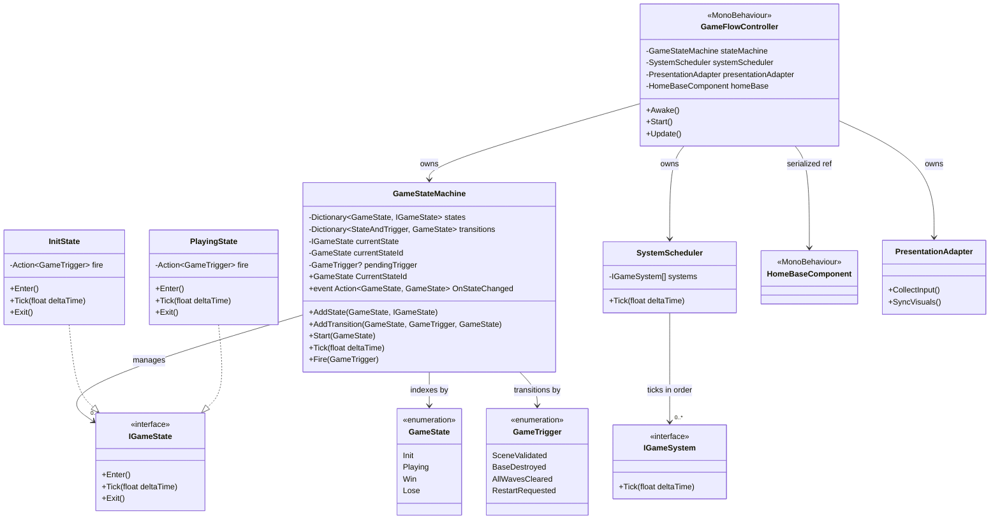
```mermaid
classDiagram
    class GameFlowController {
        <<MonoBehaviour>>
        -GameStateMachine stateMachine
        -SystemScheduler systemScheduler
        -PresentationAdapter presentationAdapter
        -HomeBaseComponent homeBase
        +Awake()
        +Start()
        +Update()
    }

    class GameStateMachine {
        -Dictionary~GameState, IGameState~ states
        -Dictionary~StateAndTrigger, GameState~ transitions
        -IGameState currentState
        -GameState currentStateId
        -GameTrigger? pendingTrigger
        +GameState CurrentStateId
        +event Action~GameState, GameState~ OnStateChanged
        +AddState(GameState, IGameState)
        +AddTransition(GameState, GameTrigger, GameState)
        +Start(GameState)
        +Tick(float deltaTime)
        +Fire(GameTrigger)
    }

    class IGameState {
        <<interface>>
        +Enter()
        +Tick(float deltaTime)
        +Exit()
    }

    class GameState {
        <<enumeration>>
        Init
        Playing
        Win
        Lose
    }

    class GameTrigger {
        <<enumeration>>
        SceneValidated
        BaseDestroyed
        AllWavesCleared
        RestartRequested
    }

    class InitState {
        -Action~GameTrigger~ fire
        +Enter()
        +Tick(float deltaTime)
        +Exit()
    }

    class PlayingState {
        -Action~GameTrigger~ fire
        +Enter()
        +Tick(float deltaTime)
        +Exit()
    }

    class SystemScheduler {
        -IGameSystem[] systems
        +Tick(float deltaTime)
    }

    class IGameSystem {
        <<interface>>
        +Tick(float deltaTime)
    }

    class HomeBaseComponent {
        <<MonoBehaviour>>
    }

    class PresentationAdapter {
        +CollectInput()
        +SyncVisuals()
    }

    GameFlowController --> GameStateMachine : owns
    GameFlowController --> SystemScheduler : owns
    GameFlowController --> PresentationAdapter : owns
    GameFlowController --> HomeBaseComponent : serialized ref
    GameStateMachine --> "0..*" IGameState : manages
    GameStateMachine --> GameState : indexes by
    GameStateMachine --> GameTrigger : transitions by
    InitState ..|> IGameState
    PlayingState ..|> IGameState
    SystemScheduler --> "0..*" IGameSystem : ticks in order
```

**Notes:**
- `GameFlowController` is the composition root MonoBehaviour. It creates the state machine, system scheduler, states, systems, and `GameUiCoordinator`. Configures the transition table and wires references.
- `GameStateMachine` and all `IGameState` implementations are **plain C# classes**, not MonoBehaviours.
- `HomeBaseComponent` is a thin MonoBehaviour on the Base GameObject in the scene. It holds no logic — just identifies the object for system discovery.
- States receive an `Action<GameTrigger>` delegate at construction. They fire semantic triggers (`SceneValidated`, `BaseDestroyed`, etc.) without knowing which state the trigger leads to. The transition table in `GameFlowController` maps `(state, trigger) → destination`.
- **States are flow-only** — they manage enter/exit lifecycle and fire triggers. States do not own or tick systems.
- `SystemScheduler` is a **plain C# class** owned by `GameFlowController`. It holds the ordered `IGameSystem[]` array and ticks them sequentially. `GameFlowController.Update()` gates the scheduler — systems only tick when the state machine is in a gameplay state (e.g., `Playing`). This separates flow control (states) from system execution (scheduler).
- `IGameSystem` provides a uniform `Tick()` contract for gameplay systems. Systems are global — they exist independently of game states.
- `PresentationAdapter` is a **plain C# class** owned by `GameFlowController`. It is the only place that calls Unity input and rendering APIs. Systems never reference it directly — they read input structs it produces and write sim data it consumes. Stub in Story 1; gains responsibilities as systems are added.
- All four states (`Init`, `Playing`, `Win`, `Lose`) and their `IGameState` implementations exist. `WinState` and `LoseState` are empty shells — presentation (popups, HUD toggling) is handled by `GameUiCoordinator`.
- `GameTrigger` values are added incrementally as stories introduce new transitions. `RestartRequested` was added in Story 10.
- **Trigger-during-Enter fix (Story 10):** `Tick()` clears `pendingTrigger` before `ResolveTrigger()`, so triggers fired during `Enter()` survive to the next tick. This is critical for the restart cycle where `InitState.Enter()` fires `SceneValidated`.

---

## Game State Diagram

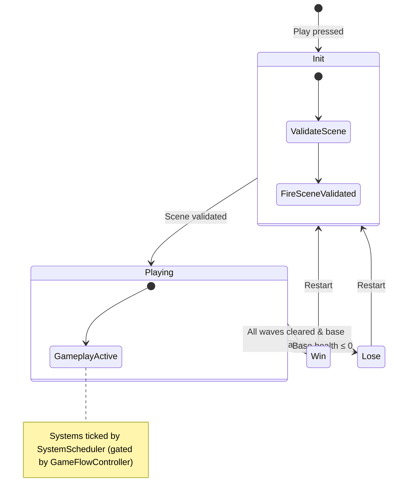
```mermaid
stateDiagram-v2
    [*] --> Init : Play pressed

    Init --> Playing : Scene validated

    Playing --> Win : All waves cleared & base alive
    Playing --> Lose : Base health ≤ 0

    Win --> Init : Restart
    Lose --> Init : Restart

    state Init {
        [*] --> ValidateScene
        ValidateScene --> FireSceneValidated
    }

    state Playing {
        [*] --> GameplayActive
        Note right of GameplayActive : Systems ticked by SystemScheduler (gated by GameFlowController)
    }
```

**Story 1 scope:** All four states are implemented. `Init` and `Playing` contain logic; `Win` and `Lose` are empty shells. Presentation concerns (popups, HUD toggling) are handled by `GameUiCoordinator.OnStateChanged`.

**Reset path (Story 10):** R key press in Win/Lose → `GameFlowController` fires `RestartRequested` → state machine transitions to `Init`. `OnStateChanged` handler runs full reset: `ResetVisuals()` → `GameSession.Reset()` → system resets → `GameUiCoordinator.Refresh()`. `InitState.Enter()` fires `SceneValidated` (survives via trigger-during-Enter fix), resolving to `Playing` on the next tick. Two-frame transition: Frame N resets, Frame N+1 enters Playing with clean state.

---

## Startup Sequence

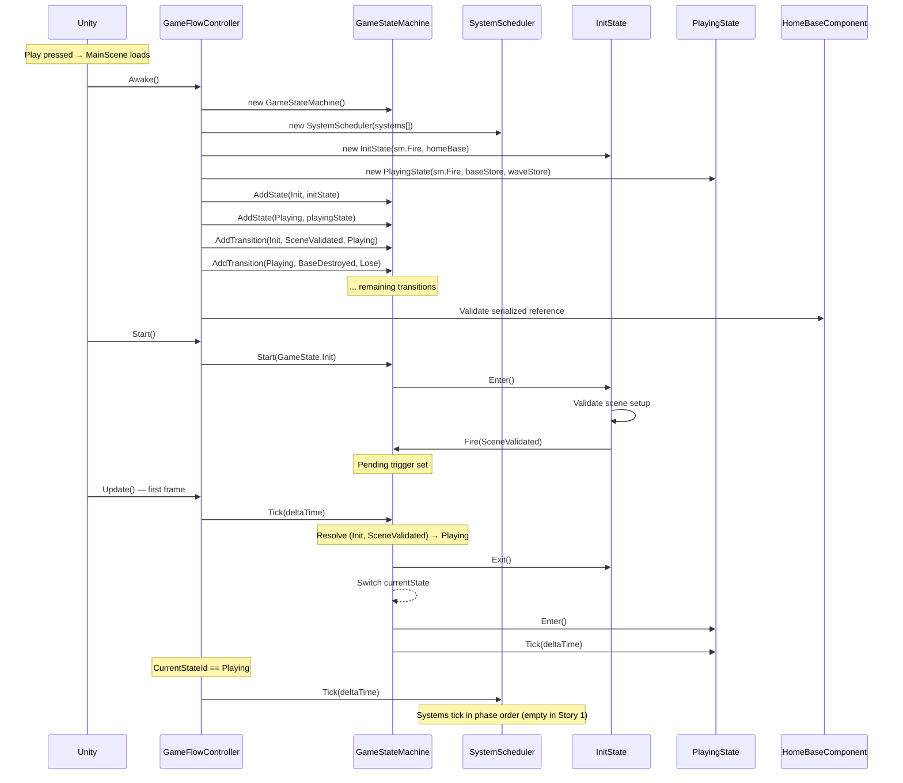
```mermaid
sequenceDiagram
    participant Unity
    participant Bootstrap as GameFlowController
    participant SM as GameStateMachine
    participant Sched as SystemScheduler
    participant Init as InitState
    participant Playing as PlayingState
    participant Base as HomeBaseComponent

    Note over Unity: Play pressed → MainScene loads

    Unity->>Bootstrap: Awake()
    Bootstrap->>SM: new GameStateMachine()
    Bootstrap->>Sched: new SystemScheduler(systems[])
    Bootstrap->>Init: new InitState(sm.Fire, homeBase)
    Bootstrap->>Playing: new PlayingState(sm.Fire, baseStore, waveStore)
    Bootstrap->>SM: AddState(Init, initState)
    Bootstrap->>SM: AddState(Playing, playingState)
    Bootstrap->>SM: AddTransition(Init, SceneValidated, Playing)
    Bootstrap->>SM: AddTransition(Playing, BaseDestroyed, Lose)
    Note over SM: ... remaining transitions
    Bootstrap->>Base: Validate serialized reference

    Unity->>Bootstrap: Start()
    Bootstrap->>SM: Start(GameState.Init)
    SM->>Init: Enter()
    Init->>Init: Validate scene setup
    Init->>SM: Fire(SceneValidated)

    Note over SM: Pending trigger set

    Unity->>Bootstrap: Update() — first frame
    Bootstrap->>SM: Tick(deltaTime)
    Note over SM: Resolve (Init, SceneValidated) → Playing
    SM->>Init: Exit()
    SM-->>SM: Switch currentState
    SM->>Playing: Enter()
    SM->>Playing: Tick(deltaTime)

    Note over Bootstrap: CurrentStateId == Playing
    Bootstrap->>Sched: Tick(deltaTime)
    Note over Sched: Systems tick in phase order (empty in Story 1)
```

**Key points:**
- `GameFlowController.Awake()` constructs everything — state machine, system scheduler, states — and configures the transition table. `Start()` kicks off the state machine.
- `InitState.Enter()` fires `SceneValidated` — it does not know the destination. The trigger is **pending** — not resolved until the next `Tick()`.
- The state machine resolves triggers at the **start** of `Tick()`: lookup `(currentState, trigger)` in transition table → `Exit()` old → switch → `Enter()` new → `Tick()` new. This guarantees one clean frame boundary between states.
- States only depend on `Action<GameTrigger>` — no reference to other states or to `GameStateMachine` itself. This makes states independently testable.
- System ticking is separate from state ticking. `GameFlowController` gates the scheduler based on the current state — systems only run during gameplay.

---

## Per-Frame Tick Flow

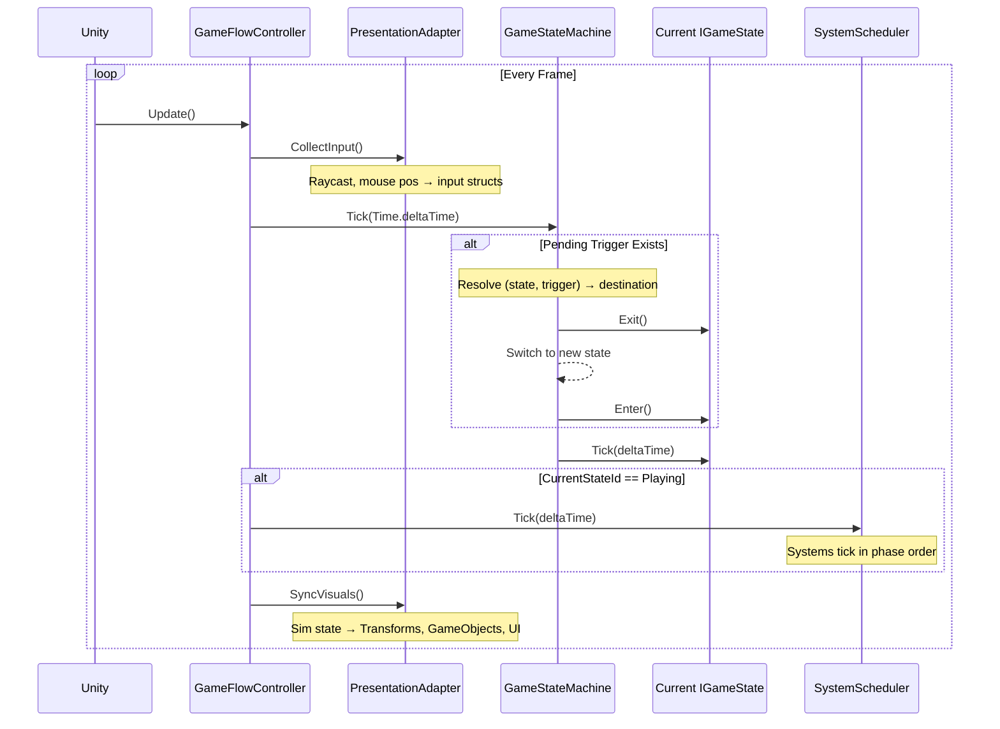
```mermaid
sequenceDiagram
    participant Unity
    participant Bootstrap as GameFlowController
    participant Pres as PresentationAdapter
    participant SM as GameStateMachine
    participant State as Current IGameState
    participant Sched as SystemScheduler

    loop Every Frame
        Unity->>Bootstrap: Update()

        Bootstrap->>Pres: CollectInput()
        Note over Pres: Raycast, mouse pos → input structs

        Bootstrap->>SM: Tick(Time.deltaTime)

        alt Pending Trigger Exists
            Note over SM: Resolve (state, trigger) → destination
            SM->>State: Exit()
            SM-->>SM: Switch to new state
            SM->>State: Enter()
        end

        SM->>State: Tick(deltaTime)

        alt CurrentStateId == Playing
            Bootstrap->>Sched: Tick(deltaTime)
            Note over Sched: Systems tick in phase order
        end

        Bootstrap->>Pres: SyncVisuals()
        Note over Pres: Sim state → Transforms, GameObjects, UI
    end
```

**Frame boundary contract:** Each frame has four phases with unidirectional data flow:
1. **Input collection** — `PresentationAdapter.CollectInput()` reads Unity inputs (mouse position, raycasts, keyboard) and writes them into sim-readable input structs. Systems never call Unity input APIs directly.
2. **State tick** — The state machine resolves pending triggers and ticks the current state. States manage flow (enter/exit, fire triggers) — not system execution.
3. **System tick** — `GameFlowController` gates the `SystemScheduler` based on the current state. Systems tick in deterministic phase order. Systems read/write only simulation data (structs, arrays). No Unity API calls.
4. **Visual sync** — `PresentationAdapter.SyncVisuals()` reads simulation state and writes to Unity objects (`Transform.position`, enable/disable GameObjects, UI updates). The sim is unaware this step exists.

**Story 1:** The `SystemScheduler` holds an empty `IGameSystem[]` array — no systems yet. The presentation adapter is a stub. Future stories add systems to the scheduler in `GameFlowController`.

---

## System Scheduler — System Phases & Tick Order

Shows how `IGameSystem` implementations will be ticked by `SystemScheduler` as stories are implemented. Systems are grouped into three conceptual phases. All systems are plain C# classes implementing `IGameSystem`, registered in order via `GameFlowController`. The scheduler is gated by the state machine — systems only tick during gameplay states.

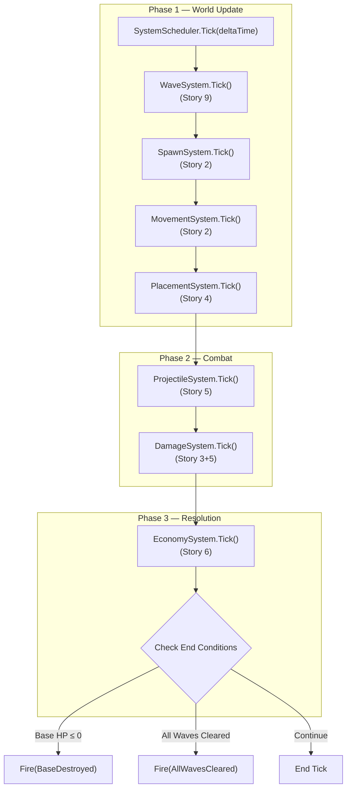
```mermaid
flowchart TD
    subgraph phase1 ["Phase 1 — World Update"]
        A["SystemScheduler.Tick(deltaTime)"] --> B["WaveSystem.Tick()
        (Story 9)"]
        B --> C["SpawnSystem.Tick()
        (Story 2)"]
        C --> D["MovementSystem.Tick()
        (Story 2)"]
        D --> E["PlacementSystem.Tick()
        (Story 4)"]
    end
    subgraph phase2 ["Phase 2 — Combat"]
        E --> G["ProjectileSystem.Tick()
        (Story 5)"]
        G --> H["DamageSystem.Tick()
        (Story 3+5)"]
    end
    subgraph phase3 ["Phase 3 — Resolution"]
        H --> I["EconomySystem.Tick()
        (Story 6)"]
        I --> J{"Check End Conditions"}
    end
    J -->|"Base HP ≤ 0"| K["Fire(BaseDestroyed)"]
    J -->|"All Waves Cleared"| L["Fire(AllWavesCleared)"]
    J -->|"Continue"| M["End Tick"]
```

**System phases:**

| Phase | Systems | Purpose |
|-------|---------|---------|
| **1 — World Update** | Wave, Spawn, Movement, Placement | Bring all entities to current-frame state; process player input |
| **2 — Combat** | Projectile, Damage | Resolve attacks using positions settled in Phase 1 |
| **3 — Resolution** | Economy, End Conditions | Process rewards and check win/lose after combat settles |

**Tick order within phases:**
1. **Waves** decide what to spawn this frame
2. **Spawn** creates new creeps from wave data
3. **Movement** advances all creeps toward the base
4. **Placement** processes player turret placement input — placed turrets are available for targeting this frame
5. **Projectiles** fires new projectiles (inline target selection: nearest alive creep in range), advances in-flight projectiles, checks hits, records hits via `ProjectileStore.RecordHit()`
6. **Damage** applies projectile hit damage to creeps, removes dead creeps (`OnCreepKilled`), applies base damage on arrival (dead-creep guard skips killed creeps)
8. **Economy** processes coin awards from kills
9. **Conditions** check win/lose after all systems have settled

---

## Folder Structure

```
Assets/
├── Scripts/
│   ├── App/                      # Composition root, session, game state/trigger enums, turret type directory builder
│   │   ├── GameFlowController.cs
│   │   ├── GameSession.cs
│   │   ├── GameState.cs
│   │   ├── GameTrigger.cs
│   │   ├── TurretTypeDirectory.cs
│   │   ├── TurretTypeDirectoryBuilder.cs
│   │   ├── CreepTypeDirectory.cs
│   │   └── CreepTypeDirectoryBuilder.cs
│   ├── Framework/                # Reusable infrastructure
│   │   ├── StateMachine/
│   │   │   ├── GameStateMachine.cs
│   │   │   └── IGameState.cs
│   │   ├── Scheduling/
│   │   │   ├── SystemScheduler.cs
│   │   │   └── IGameSystem.cs
│   │   └── Pooling/
│   │       ├── IPoolable.cs
│   │       └── GameObjectPool.cs
│   ├── States/                   # IGameState implementations
│   │   ├── InitState.cs
│   │   ├── PlayingState.cs
│   │   ├── WinState.cs
│   │   └── LoseState.cs
│   ├── Stores/                   # Authoritative data containers
│   │   ├── CreepStore.cs
│   │   ├── BaseStore.cs
│   │   ├── TurretStore.cs
│   │   ├── ProjectileStore.cs
│   │   ├── EconomyStore.cs
│   │   ├── TurretSelectionStore.cs
│   │   └── WaveStore.cs
│   ├── SimData/                  # Pure simulation data classes/structs
│   │   ├── CreepSimData.cs
│   │   ├── TurretSimData.cs
│   │   ├── ProjectileSimData.cs
│   │   ├── ProjectileHit.cs
│   │   ├── TurretType.cs
│   │   ├── TurretTypeStats.cs
│   │   ├── CreepType.cs
│   │   └── CreepTypeStats.cs
│   ├── Systems/                  # IGameSystem implementations
│   │   ├── WaveSystem.cs
│   │   ├── SpawnSystem.cs
│   │   ├── MovementSystem.cs
│   │   ├── PlacementSystem.cs
│   │   ├── ProjectileSystem.cs
│   │   ├── DamageSystem.cs
│   │   └── EconomySystem.cs
│   ├── Components/               # Thin MonoBehaviour prefab hooks
│   │   ├── HomeBaseComponent.cs
│   │   ├── SpawnPointComponent.cs
│   │   ├── CreepComponent.cs
│   │   ├── TurretComponent.cs
│   │   └── ProjectileComponent.cs
│   ├── Input/                    # Sim-readable input bridges
│   │   └── PlacementInput.cs
│   ├── Presentation/             # Unity view sync, UI bindings, coordinators
│   │   ├── PresentationAdapter.cs
│   │   ├── GameUiCoordinator.cs
│   │   ├── BaseHealthHud.cs
│   │   ├── CoinHud.cs
│   │   ├── TurretSelectionHud.cs
│   │   ├── RestartHintHud.cs
│   │   ├── BaseHealthHud.uss
│   │   ├── BaseHealthHud.uxml
│   │   └── DefaultPanel Settings.asset
│   └── Data/                     # ScriptableObject definitions
│       ├── CreepTypeDefinition.cs
│       ├── CreepDefinitions.cs
│       ├── SpawnConfig.cs         # (retired — replaced by WaveConfig)
│       ├── BaseConfig.cs
│       ├── TurretTypeDefinition.cs
│       ├── TurretDefinitions.cs
│       ├── EconomyConfig.cs
│       ├── WaveEntryDefinition.cs
│       ├── WaveDefinition.cs
│       └── WaveConfig.cs
├── Tests/
│   ├── Editor/
│   │   ├── EditModeTests.asmdef
│   │   ├── GameStateMachineTests.cs
│   │   ├── InitStateTests.cs
│   │   ├── SystemSchedulerTests.cs
│   │   ├── CreepStoreTests.cs
│   │   ├── SpawnSystemTests.cs
│   │   ├── MovementSystemTests.cs
│   │   ├── GameObjectPoolTests.cs
│   │   ├── CreepSpawningIntegrationTests.cs
│   │   ├── BaseStoreTests.cs
│   │   ├── DamageSystemTests.cs
│   │   ├── PlayingStateTests.cs
│   │   ├── LoseStateTests.cs
│   │   ├── BaseHealthIntegrationTests.cs
│   │   ├── TurretStoreTests.cs
│   │   ├── PlacementSystemTests.cs
│   │   ├── TurretPlacementIntegrationTests.cs
│   │   ├── ProjectileStoreTests.cs
│   │   ├── ProjectileSystemTests.cs
│   │   ├── TurretShootingIntegrationTests.cs
│   │   ├── GameUiCoordinatorTests.cs
│   │   ├── EconomyStoreTests.cs
│   │   ├── EconomySystemTests.cs
│   │   ├── EconomyIntegrationTests.cs
│   │   ├── TurretTypesTests.cs
│   │   ├── TurretTypesIntegrationTests.cs
│   │   ├── TurretTypeDirectoryBuilderTests.cs
│   │   ├── CreepTypeDirectoryBuilderTests.cs
│   │   ├── CreepVarietyIntegrationTests.cs
│   │   ├── WaveStoreTests.cs
│   │   ├── WaveSystemTests.cs
│   │   ├── WinStateTests.cs
│   │   ├── WaveIntegrationTests.cs
│   │   ├── GameResetTests.cs
│   │   └── GameResetIntegrationTests.cs
│   └── Runtime/
│       └── RuntimeTests.asmdef
├── Prefabs/
├── Scenes/
├── Materials/
└── Terrain/
```

No project-wide namespace. Role-based folders group classes by architectural role. Generic reusable infrastructure (`ObjectPooling`) gets its own namespace.

---

## Story 2 — Creep Spawning & Movement

### Class Diagram

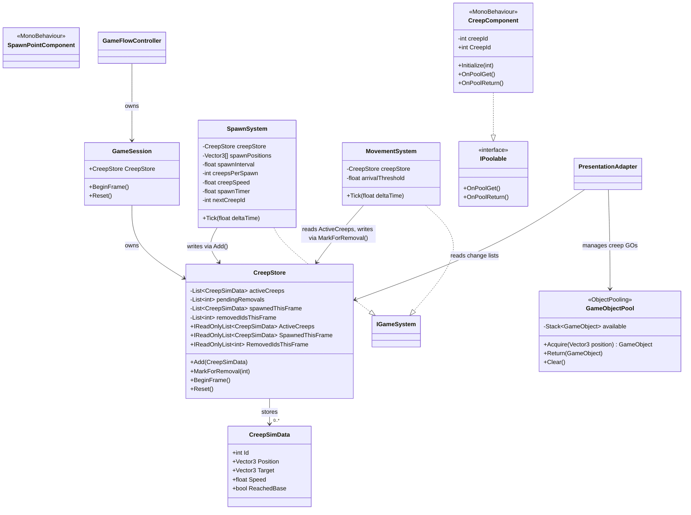
```mermaid
classDiagram
    class GameSession {
        +CreepStore CreepStore
        +BeginFrame()
        +Reset()
    }

    class CreepStore {
        -List~CreepSimData~ activeCreeps
        -List~int~ pendingRemovals
        -List~CreepSimData~ spawnedThisFrame
        -List~int~ removedIdsThisFrame
        +IReadOnlyList~CreepSimData~ ActiveCreeps
        +IReadOnlyList~CreepSimData~ SpawnedThisFrame
        +IReadOnlyList~int~ RemovedIdsThisFrame
        +Add(CreepSimData)
        +MarkForRemoval(int)
        +BeginFrame()
        +Reset()
    }

    class CreepSimData {
        +int Id
        +Vector3 Position
        +Vector3 Target
        +float Speed
        +bool ReachedBase
    }

    class SpawnSystem {
        -CreepStore creepStore
        -Vector3[] spawnPositions
        -float spawnInterval
        -int creepsPerSpawn
        -float creepSpeed
        -float spawnTimer
        -int nextCreepId
        +Tick(float deltaTime)
    }

    class MovementSystem {
        -CreepStore creepStore
        -float arrivalThreshold
        +Tick(float deltaTime)
    }

    class SpawnPointComponent {
        <<MonoBehaviour>>
    }

    class CreepComponent {
        <<MonoBehaviour>>
        -int creepId
        +int CreepId
        +Initialize(int)
        +OnPoolGet()
        +OnPoolReturn()
    }

    class GameObjectPool {
        <<ObjectPooling>>
        -Stack~GameObject~ available
        +Acquire(Vector3 position) GameObject
        +Return(GameObject)
        +Clear()
    }

    class IPoolable {
        <<interface>>
        <<ObjectPooling>>
        +OnPoolGet()
        +OnPoolReturn()
    }

    GameSession --> CreepStore : owns
    CreepStore --> "0..*" CreepSimData : stores
    SpawnSystem --> CreepStore : writes via Add()
    MovementSystem --> CreepStore : reads ActiveCreeps, writes via MarkForRemoval()
    SpawnSystem ..|> IGameSystem
    MovementSystem ..|> IGameSystem
    CreepComponent ..|> IPoolable
    PresentationAdapter --> CreepStore : reads change lists
    PresentationAdapter --> GameObjectPool : manages creep GOs
    GameFlowController --> GameSession : owns
```

**Notes:**
- `SpawnSystem` and `MovementSystem` depend only on `CreepStore`, never on each other. No system-to-system coupling.
- `CreepStore` manages deferred removals: `MarkForRemoval()` buffers IDs, `BeginFrame()` flushes them and populates `RemovedIdsThisFrame`.
- `PresentationAdapter` reads `SpawnedThisFrame` and `RemovedIdsThisFrame` to efficiently manage the object pool — no O(n^2) diffing.
- `GameObjectPool.Acquire(position)` sets transform position before activation to avoid one-frame visual pop at origin.

### Creep Lifecycle Sequence

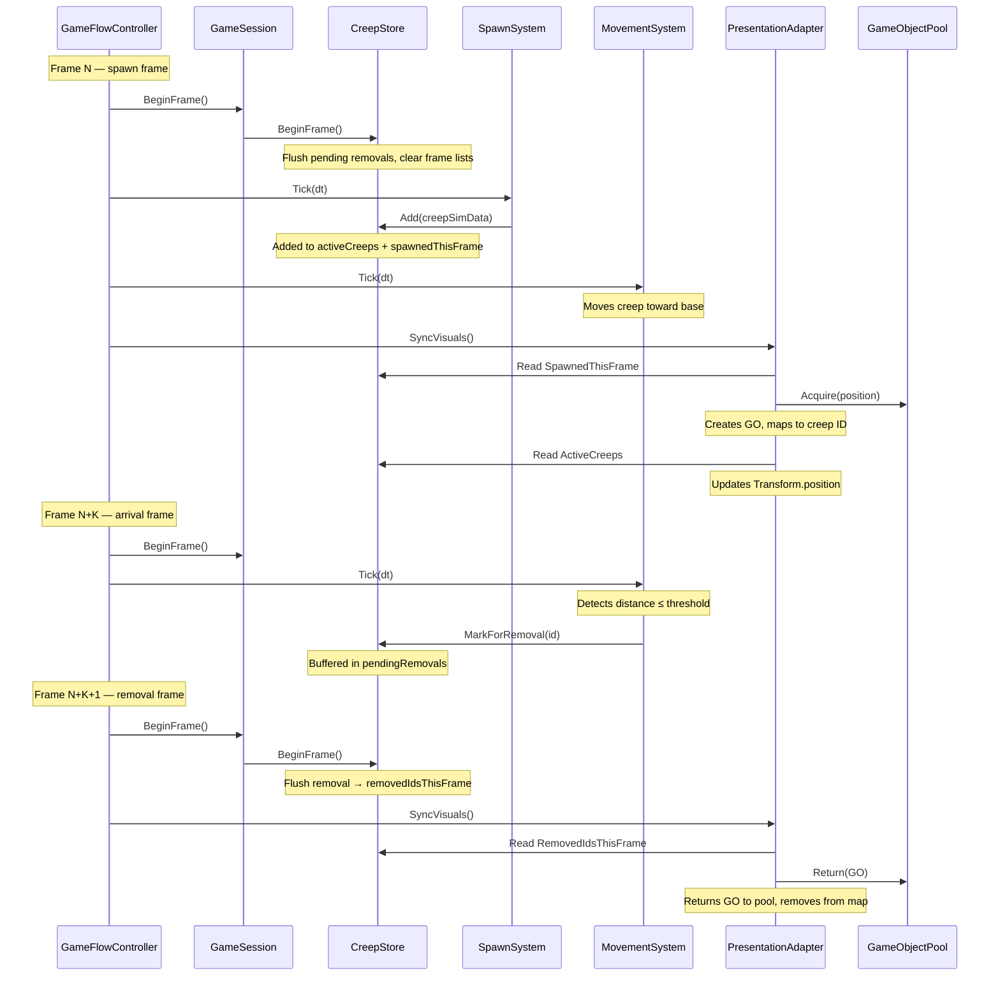
```mermaid
sequenceDiagram
    participant Bootstrap as GameFlowController
    participant Session as GameSession
    participant Store as CreepStore
    participant Spawn as SpawnSystem
    participant Move as MovementSystem
    participant Pres as PresentationAdapter
    participant Pool as GameObjectPool

    Note over Bootstrap: Frame N — spawn frame

    Bootstrap->>Session: BeginFrame()
    Session->>Store: BeginFrame()
    Note over Store: Flush pending removals, clear frame lists

    Bootstrap->>Spawn: Tick(dt)
    Spawn->>Store: Add(creepSimData)
    Note over Store: Added to activeCreeps + spawnedThisFrame

    Bootstrap->>Move: Tick(dt)
    Note over Move: Moves creep toward base

    Bootstrap->>Pres: SyncVisuals()
    Pres->>Store: Read SpawnedThisFrame
    Pres->>Pool: Acquire(position)
    Note over Pres: Creates GO, maps to creep ID

    Pres->>Store: Read ActiveCreeps
    Note over Pres: Updates Transform.position

    Note over Bootstrap: Frame N+K — arrival frame

    Bootstrap->>Session: BeginFrame()
    Bootstrap->>Move: Tick(dt)
    Note over Move: Detects distance ≤ threshold
    Move->>Store: MarkForRemoval(id)
    Note over Store: Buffered in pendingRemovals

    Note over Bootstrap: Frame N+K+1 — removal frame

    Bootstrap->>Session: BeginFrame()
    Session->>Store: BeginFrame()
    Note over Store: Flush removal → removedIdsThisFrame

    Bootstrap->>Pres: SyncVisuals()
    Pres->>Store: Read RemovedIdsThisFrame
    Pres->>Pool: Return(GO)
    Note over Pres: Returns GO to pool, removes from map
```

---

## Story 3 — Base Health & Lose Condition

### Class Diagram

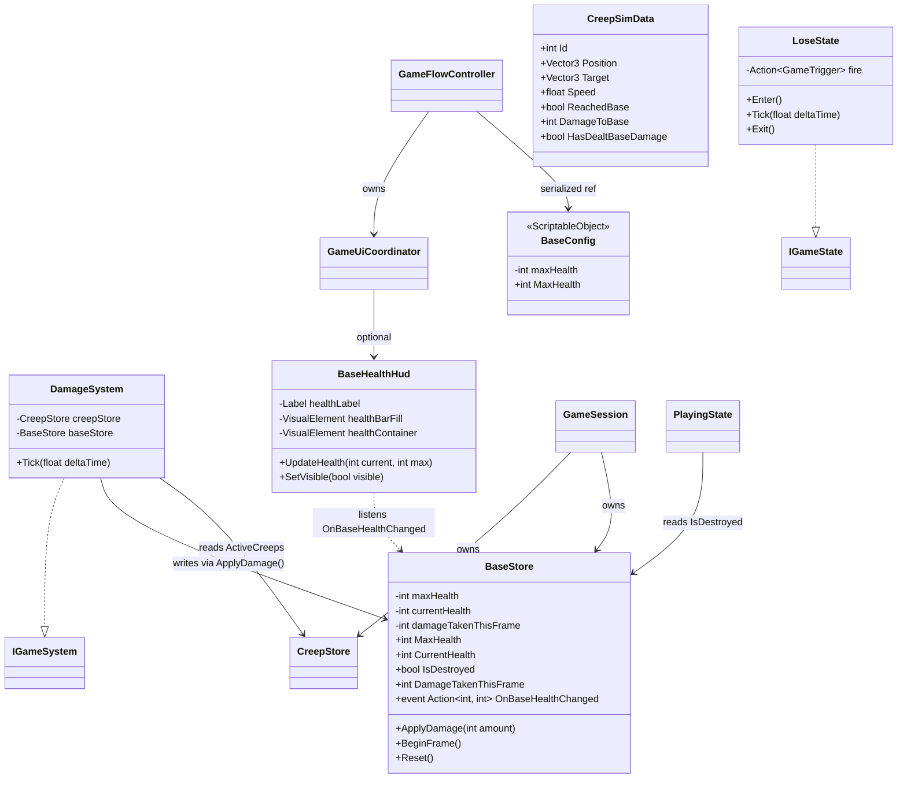
```mermaid
classDiagram
    class BaseStore {
        -int maxHealth
        -int currentHealth
        -int damageTakenThisFrame
        +int MaxHealth
        +int CurrentHealth
        +bool IsDestroyed
        +int DamageTakenThisFrame
        +event Action~int, int~ OnBaseHealthChanged
        +ApplyDamage(int amount)
        +BeginFrame()
        +Reset()
    }

    class DamageSystem {
        -CreepStore creepStore
        -BaseStore baseStore
        +Tick(float deltaTime)
    }

    class LoseState {
        -Action~GameTrigger~ fire
        +Enter()
        +Tick(float deltaTime)
        +Exit()
    }

    class BaseConfig {
        <<ScriptableObject>>
        -int maxHealth
        +int MaxHealth
    }

    class BaseHealthHud {
        -Label healthLabel
        -VisualElement healthBarFill
        -VisualElement healthContainer
        +UpdateHealth(int current, int max)
        +SetVisible(bool visible)
    }

    class CreepSimData {
        +int Id
        +Vector3 Position
        +Vector3 Target
        +float Speed
        +bool ReachedBase
        +int DamageToBase
        +bool HasDealtBaseDamage
    }

    GameSession --> BaseStore : owns
    GameSession --> CreepStore : owns
    DamageSystem --> CreepStore : reads ActiveCreeps
    DamageSystem --> BaseStore : writes via ApplyDamage()
    DamageSystem ..|> IGameSystem
    LoseState ..|> IGameState
    PlayingState --> BaseStore : reads IsDestroyed
    BaseHealthHud ..> BaseStore : listens OnBaseHealthChanged
    GameFlowController --> BaseConfig : serialized ref
    GameFlowController --> GameUiCoordinator : owns
    GameUiCoordinator --> BaseHealthHud : optional
```

**Notes:**
- `DamageSystem` reads `CreepStore.ActiveCreeps` and writes `BaseStore` via `ApplyDamage()`. Gates on `ReachedBase && !HasDealtBaseDamage` to prevent double-damage.
- `BaseStore` fires `OnBaseHealthChanged` for UI updates. `ApplyDamage` is idempotent after destruction (no event, no state change once health is 0).
- `PlayingState` polls `BaseStore.IsDestroyed` in `Tick()` — not event-driven — because event handlers must not fire game triggers per the event handler discipline.
- `LoseState` is empty; `GameUiCoordinator.OnStateChanged` toggles the LosePopup as a presentation concern.
- `BaseHealthHud` is a plain C# class (not MonoBehaviour) that binds to a `UIDocument` and updates via `OnBaseHealthChanged` event.

### Base Damage Sequence

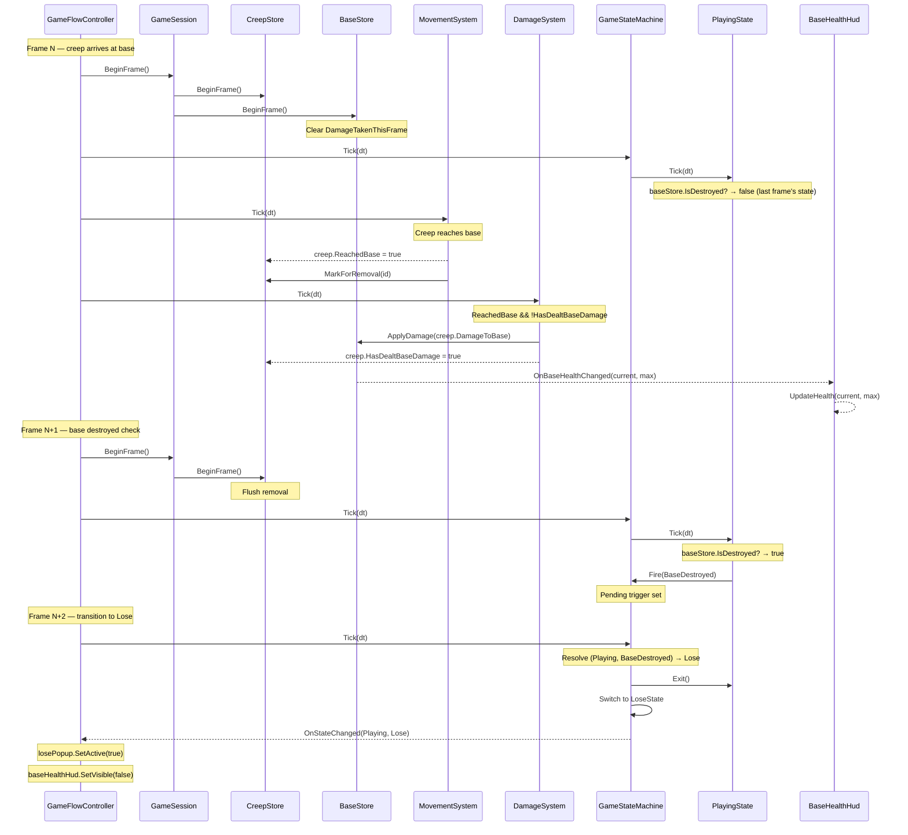
```mermaid
sequenceDiagram
    participant Bootstrap as GameFlowController
    participant Session as GameSession
    participant CStore as CreepStore
    participant BStore as BaseStore
    participant Move as MovementSystem
    participant Dmg as DamageSystem
    participant SM as GameStateMachine
    participant Playing as PlayingState
    participant HUD as BaseHealthHud

    Note over Bootstrap: Frame N — creep arrives at base

    Bootstrap->>Session: BeginFrame()
    Session->>CStore: BeginFrame()
    Session->>BStore: BeginFrame()
    Note over BStore: Clear DamageTakenThisFrame

    Bootstrap->>SM: Tick(dt)
    SM->>Playing: Tick(dt)
    Note over Playing: baseStore.IsDestroyed? → false (last frame's state)

    Bootstrap->>Move: Tick(dt)
    Note over Move: Creep reaches base
    Move-->>CStore: creep.ReachedBase = true
    Move->>CStore: MarkForRemoval(id)

    Bootstrap->>Dmg: Tick(dt)
    Note over Dmg: ReachedBase && !HasDealtBaseDamage
    Dmg->>BStore: ApplyDamage(creep.DamageToBase)
    Dmg-->>CStore: creep.HasDealtBaseDamage = true
    BStore-->>HUD: OnBaseHealthChanged(current, max)
    HUD-->>HUD: UpdateHealth(current, max)

    Note over Bootstrap: Frame N+1 — base destroyed check

    Bootstrap->>Session: BeginFrame()
    Session->>CStore: BeginFrame()
    Note over CStore: Flush removal

    Bootstrap->>SM: Tick(dt)
    SM->>Playing: Tick(dt)
    Note over Playing: baseStore.IsDestroyed? → true
    Playing->>SM: Fire(BaseDestroyed)
    Note over SM: Pending trigger set

    Note over Bootstrap: Frame N+2 — transition to Lose

    Bootstrap->>SM: Tick(dt)
    Note over SM: Resolve (Playing, BaseDestroyed) → Lose
    SM->>Playing: Exit()
    SM->>SM: Switch to LoseState
    SM-->>Bootstrap: OnStateChanged(Playing, Lose)
    Note over Bootstrap: losePopup.SetActive(true)
    Note over Bootstrap: baseHealthHud.SetVisible(false)
```

**Key timing:**
- **Frame N**: MovementSystem sets `ReachedBase`, DamageSystem applies damage, HUD updates via event.
- **Frame N+1**: `PlayingState.Tick()` detects `IsDestroyed`, fires `BaseDestroyed` (pending trigger).
- **Frame N+2**: State machine resolves trigger, transitions to Lose, popup appears.
- Systems do not tick in Lose state (gated by `CurrentStateId == Playing` in `GameFlowController.Update()`).

---

## Story 4 — Turret Placement

### Class Diagram

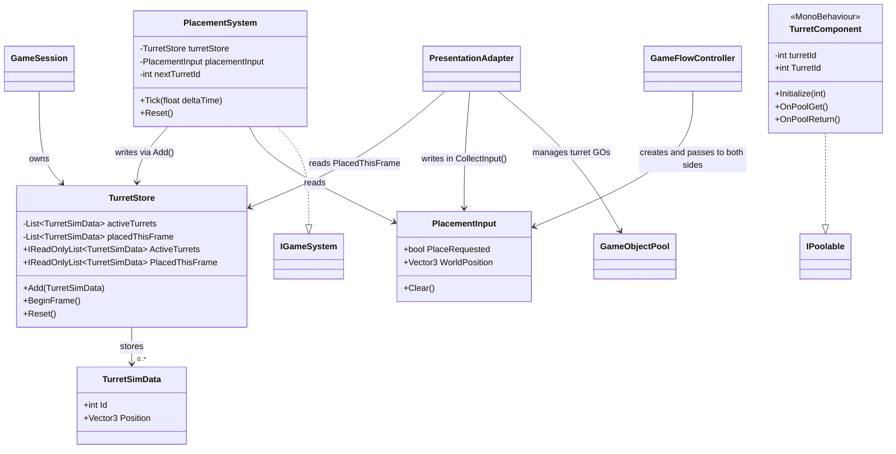
```mermaid
classDiagram
    class TurretStore {
        -List~TurretSimData~ activeTurrets
        -List~TurretSimData~ placedThisFrame
        +IReadOnlyList~TurretSimData~ ActiveTurrets
        +IReadOnlyList~TurretSimData~ PlacedThisFrame
        +Add(TurretSimData)
        +BeginFrame()
        +Reset()
    }

    class TurretSimData {
        +int Id
        +Vector3 Position
    }

    class PlacementInput {
        +bool PlaceRequested
        +Vector3 WorldPosition
        +Clear()
    }

    class PlacementSystem {
        -TurretStore turretStore
        -PlacementInput placementInput
        -int nextTurretId
        +Tick(float deltaTime)
        +Reset()
    }

    class TurretComponent {
        <<MonoBehaviour>>
        -int turretId
        +int TurretId
        +Initialize(int)
        +OnPoolGet()
        +OnPoolReturn()
    }

    GameSession --> TurretStore : owns
    TurretStore --> "0..*" TurretSimData : stores
    PlacementSystem --> TurretStore : writes via Add()
    PlacementSystem --> PlacementInput : reads
    PlacementSystem ..|> IGameSystem
    TurretComponent ..|> IPoolable
    PresentationAdapter --> TurretStore : reads PlacedThisFrame
    PresentationAdapter --> PlacementInput : writes in CollectInput()
    PresentationAdapter --> GameObjectPool : manages turret GOs
    GameFlowController --> PlacementInput : creates and passes to both sides
```

**Notes:**
- `PlacementInput` is a shared object created by `GameFlowController` and passed to both `PresentationAdapter` (writer) and `PlacementSystem` (reader). Neither depends on the other.
- `TurretStore` is minimal for Story 4: no removal pipeline. `BeginFrame()` clears `PlacedThisFrame`. `Reset()` clears everything.
- `PlacementSystem` clears `PlacementInput` after consuming to prevent double-placement if execution order changes.
- `TurretComponent` follows `CreepComponent` pattern: thin MonoBehaviour + `IPoolable`, no logic.

### Turret Placement Sequence

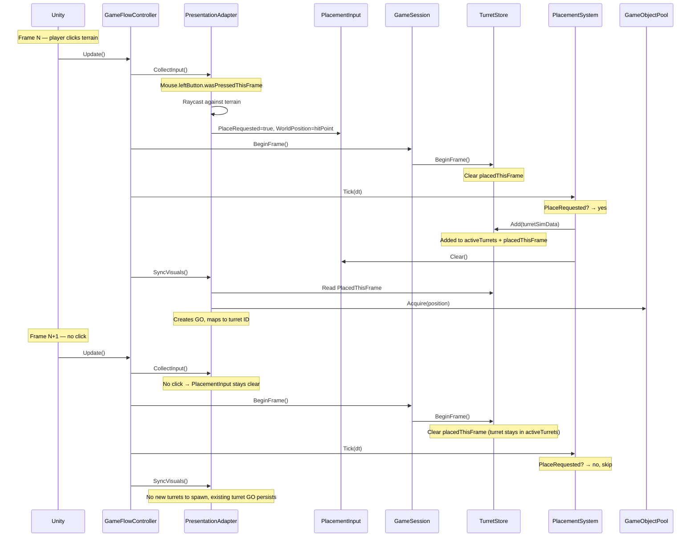
```mermaid
sequenceDiagram
    participant Unity
    participant Bootstrap as GameFlowController
    participant Pres as PresentationAdapter
    participant Input as PlacementInput
    participant Session as GameSession
    participant TStore as TurretStore
    participant Place as PlacementSystem
    participant Pool as GameObjectPool

    Note over Unity: Frame N — player clicks terrain

    Unity->>Bootstrap: Update()
    Bootstrap->>Pres: CollectInput()
    Note over Pres: Mouse.leftButton.wasPressedThisFrame
    Pres->>Pres: Raycast against terrain
    Pres->>Input: PlaceRequested=true, WorldPosition=hitPoint

    Bootstrap->>Session: BeginFrame()
    Session->>TStore: BeginFrame()
    Note over TStore: Clear placedThisFrame

    Bootstrap->>Place: Tick(dt)
    Note over Place: PlaceRequested? → yes
    Place->>TStore: Add(turretSimData)
    Note over TStore: Added to activeTurrets + placedThisFrame
    Place->>Input: Clear()

    Bootstrap->>Pres: SyncVisuals()
    Pres->>TStore: Read PlacedThisFrame
    Pres->>Pool: Acquire(position)
    Note over Pres: Creates GO, maps to turret ID

    Note over Unity: Frame N+1 — no click

    Unity->>Bootstrap: Update()
    Bootstrap->>Pres: CollectInput()
    Note over Pres: No click → PlacementInput stays clear

    Bootstrap->>Session: BeginFrame()
    Session->>TStore: BeginFrame()
    Note over TStore: Clear placedThisFrame (turret stays in activeTurrets)

    Bootstrap->>Place: Tick(dt)
    Note over Place: PlaceRequested? → no, skip

    Bootstrap->>Pres: SyncVisuals()
    Note over Pres: No new turrets to spawn, existing turret GO persists
```

---

## Story 5 — Turret Shooting & Creep Damage

### Class Diagram

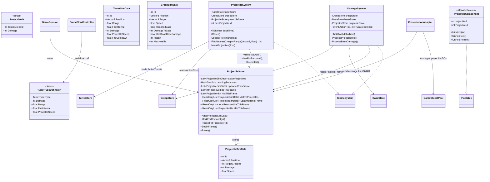
```mermaid
classDiagram
    class ProjectileStore {
        -List~ProjectileSimData~ activeProjectiles
        -HashSet~int~ pendingRemovals
        -List~ProjectileSimData~ spawnedThisFrame
        -List~int~ removedIdsThisFrame
        -List~ProjectileHit~ hitsThisFrame
        +IReadOnlyList~ProjectileSimData~ ActiveProjectiles
        +IReadOnlyList~ProjectileSimData~ SpawnedThisFrame
        +IReadOnlyList~int~ RemovedIdsThisFrame
        +IReadOnlyList~ProjectileHit~ HitsThisFrame
        +Add(ProjectileSimData)
        +MarkForRemoval(int)
        +RecordHit(ProjectileHit)
        +BeginFrame()
        +Reset()
    }

    class ProjectileSimData {
        +int Id
        +Vector3 Position
        +int TargetCreepId
        +int Damage
        +float Speed
    }

    class ProjectileHit {
        <<struct>>
        +int TargetCreepId
        +int Damage
    }

    class ProjectileSystem {
        -TurretStore turretStore
        -CreepStore creepStore
        -ProjectileStore projectileStore
        -int nextProjectileId
        +Tick(float deltaTime)
        +Reset()
        -UpdateFireTimers(float)
        -FindNearestCreepInRange(Vector3, float) int
        -MoveProjectiles(float)
    }

    class DamageSystem {
        -CreepStore creepStore
        -BaseStore baseStore
        -ProjectileStore projectileStore
        +event Action~int, int~ OnCreepKilled
        +Tick(float deltaTime)
        -ProcessProjectileHits()
        -ProcessBaseDamage()
    }

    class TurretTypeDefinition {
        <<struct>>
        +TurretType Type
        +int Damage
        +float Range
        +float FireInterval
        +float ProjectileSpeed
    }

    class TurretSimData {
        +int Id
        +Vector3 Position
        +float Range
        +float FireInterval
        +int Damage
        +float ProjectileSpeed
        +float FireCooldown
    }

    class CreepSimData {
        +int Id
        +Vector3 Position
        +Vector3 Target
        +float Speed
        +bool ReachedBase
        +int DamageToBase
        +bool HasDealtBaseDamage
        +int Health
        +int MaxHealth
    }

    class ProjectileComponent {
        <<MonoBehaviour>>
        -int projectileId
        +int ProjectileId
        +Initialize(int)
        +OnPoolGet()
        +OnPoolReturn()
    }

    GameSession --> ProjectileStore : owns
    ProjectileStore --> "0..*" ProjectileSimData : stores
    ProjectileSystem --> TurretStore : reads ActiveTurrets
    ProjectileSystem --> CreepStore : reads ActiveCreeps
    ProjectileSystem --> ProjectileStore : writes via Add(), MarkForRemoval(), RecordHit()
    ProjectileSystem ..|> IGameSystem
    DamageSystem --> CreepStore : reads/writes Health
    DamageSystem --> BaseStore : writes via ApplyDamage()
    DamageSystem --> ProjectileStore : reads HitsThisFrame
    DamageSystem ..|> IGameSystem
    ProjectileComponent ..|> IPoolable
    PresentationAdapter --> ProjectileStore : reads change lists
    PresentationAdapter --> GameObjectPool : manages projectile GOs
    GameFlowController --> TurretTypeDefinition : serialized ref
```

**Notes:**
- `ProjectileSystem` handles three concerns internally: firing (with inline target selection), movement, and hit detection. No separate `TargetingSystem`.
- Target selection is ephemeral — `FindNearestCreepInRange` scans creeps at fire time, skipping dead (`Health <= 0`) and arrived (`ReachedBase`) creeps.
- `ProjectileStore.HitsThisFrame` bridges `ProjectileSystem` (writer) → `DamageSystem` (reader). DamageSystem remains the single writer for `CreepSimData.Health`.
- `DamageSystem.OnCreepKilled(creepId, coinReward)` event passes the reward directly. `EconomySystem` subscribes and buffers credits.
- Dead-creep guards: `MovementSystem` skips `Health <= 0`, `DamageSystem.ProcessBaseDamage` skips `Health <= 0`.
- `TurretSimData` gains combat fields (Range, FireInterval, Damage, ProjectileSpeed, FireCooldown) written once at placement by `PlacementSystem`, read each tick by `ProjectileSystem`.

### Combat Sequence — Turret Fires, Projectile Hits, Creep Dies

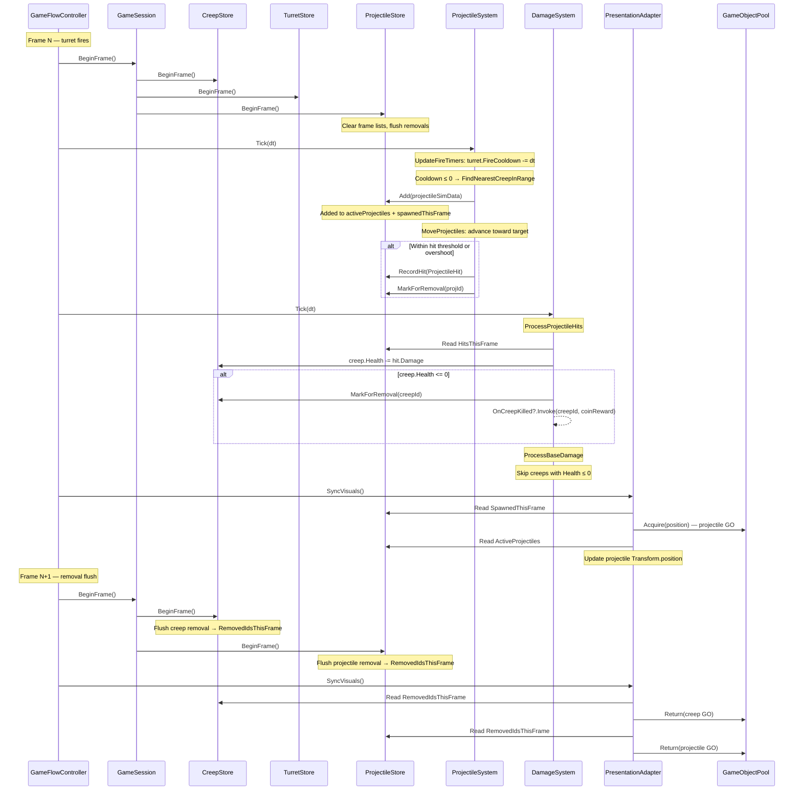
```mermaid
sequenceDiagram
    participant Bootstrap as GameFlowController
    participant Session as GameSession
    participant CStore as CreepStore
    participant TStore as TurretStore
    participant PStore as ProjectileStore
    participant ProjSys as ProjectileSystem
    participant DmgSys as DamageSystem
    participant Pres as PresentationAdapter
    participant Pool as GameObjectPool

    Note over Bootstrap: Frame N — turret fires

    Bootstrap->>Session: BeginFrame()
    Session->>CStore: BeginFrame()
    Session->>TStore: BeginFrame()
    Session->>PStore: BeginFrame()
    Note over PStore: Clear frame lists, flush removals

    Bootstrap->>ProjSys: Tick(dt)
    Note over ProjSys: UpdateFireTimers: turret.FireCooldown -= dt
    Note over ProjSys: Cooldown ≤ 0 → FindNearestCreepInRange
    ProjSys->>PStore: Add(projectileSimData)
    Note over PStore: Added to activeProjectiles + spawnedThisFrame

    Note over ProjSys: MoveProjectiles: advance toward target
    alt Within hit threshold or overshoot
        ProjSys->>PStore: RecordHit(ProjectileHit)
        ProjSys->>PStore: MarkForRemoval(projId)
    end

    Bootstrap->>DmgSys: Tick(dt)
    Note over DmgSys: ProcessProjectileHits
    DmgSys->>PStore: Read HitsThisFrame
    DmgSys->>CStore: creep.Health -= hit.Damage
    alt creep.Health <= 0
        DmgSys->>CStore: MarkForRemoval(creepId)
        DmgSys-->>DmgSys: OnCreepKilled?.Invoke(creepId, coinReward)
    end

    Note over DmgSys: ProcessBaseDamage
    Note over DmgSys: Skip creeps with Health ≤ 0

    Bootstrap->>Pres: SyncVisuals()
    Pres->>PStore: Read SpawnedThisFrame
    Pres->>Pool: Acquire(position) — projectile GO
    Pres->>PStore: Read ActiveProjectiles
    Note over Pres: Update projectile Transform.position

    Note over Bootstrap: Frame N+1 — removal flush

    Bootstrap->>Session: BeginFrame()
    Session->>CStore: BeginFrame()
    Note over CStore: Flush creep removal → RemovedIdsThisFrame
    Session->>PStore: BeginFrame()
    Note over PStore: Flush projectile removal → RemovedIdsThisFrame

    Bootstrap->>Pres: SyncVisuals()
    Pres->>CStore: Read RemovedIdsThisFrame
    Pres->>Pool: Return(creep GO)
    Pres->>PStore: Read RemovedIdsThisFrame
    Pres->>Pool: Return(projectile GO)
```

**Key timing:**
- **Frame N**: `ProjectileSystem` fires projectile, moves it, detects hit. `DamageSystem` processes hit, reduces creep health, marks dead creep for removal.
- **Frame N+1**: `BeginFrame()` flushes removals. `PresentationAdapter` returns creep and projectile GOs to their pools.
- Fast projectiles (high speed, close range) may fire and hit in the same tick. Slow projectiles persist across multiple frames, homing toward the target.
- If target is removed/dead before projectile impact, `MoveProjectiles` discards the projectile (marks for removal, no hit recorded).

---

## Story 6 — Economy System

### Class Diagram

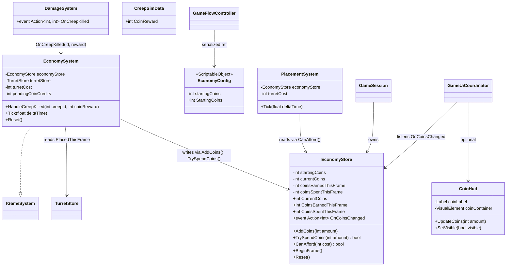
```mermaid
classDiagram
    class EconomyStore {
        -int startingCoins
        -int currentCoins
        -int coinsEarnedThisFrame
        -int coinsSpentThisFrame
        +int CurrentCoins
        +int CoinsEarnedThisFrame
        +int CoinsSpentThisFrame
        +event Action~int~ OnCoinsChanged
        +AddCoins(int amount)
        +TrySpendCoins(int amount) bool
        +CanAfford(int cost) bool
        +BeginFrame()
        +Reset()
    }

    class EconomySystem {
        -EconomyStore economyStore
        -TurretStore turretStore
        -int turretCost
        -int pendingCoinCredits
        +HandleCreepKilled(int creepId, int coinReward)
        +Tick(float deltaTime)
        +Reset()
    }

    class EconomyConfig {
        <<ScriptableObject>>
        -int startingCoins
        +int StartingCoins
    }

    class CoinHud {
        -Label coinLabel
        -VisualElement coinContainer
        +UpdateCoins(int amount)
        +SetVisible(bool visible)
    }

    class DamageSystem {
        +event Action~int, int~ OnCreepKilled
    }

    class PlacementSystem {
        -EconomyStore economyStore
        -int turretCost
        +Tick(float deltaTime)
    }

    class CreepSimData {
        +int CoinReward
    }

    GameSession --> EconomyStore : owns
    EconomySystem --> EconomyStore : writes via AddCoins(), TrySpendCoins()
    EconomySystem --> TurretStore : reads PlacedThisFrame
    EconomySystem ..|> IGameSystem
    PlacementSystem --> EconomyStore : reads via CanAfford()
    DamageSystem ..> EconomySystem : OnCreepKilled(id, reward)
    GameUiCoordinator --> CoinHud : optional
    GameUiCoordinator --> EconomyStore : listens OnCoinsChanged
    GameFlowController --> EconomyConfig : serialized ref
```

**Notes:**
- `EconomySystem` is the single writer for `EconomyStore`. `PlacementSystem` only reads via `CanAfford()`.
- `DamageSystem.OnCreepKilled(int creepId, int coinReward)` passes the reward through the event. `EconomySystem.HandleCreepKilled` buffers credits locally; they are applied during `EconomySystem.Tick()` (handler discipline).
- `PlacementSystem` gates placement on `EconomyStore.CanAfford(turretCost)`. Clears input on insufficient coins to prevent stale requests.
- `CoinHud` is a stateless view that shares the same `UIDocument` as `BaseHealthHud`. `GameUiCoordinator` forwards `OnCoinsChanged` to `CoinHud.UpdateCoins`.
- `EconomyConfig` is a ScriptableObject for `startingCoins` tuning. `GameFlowController` extracts the value at bootstrap.

### Economy Sequence — Kill Reward + Turret Placement

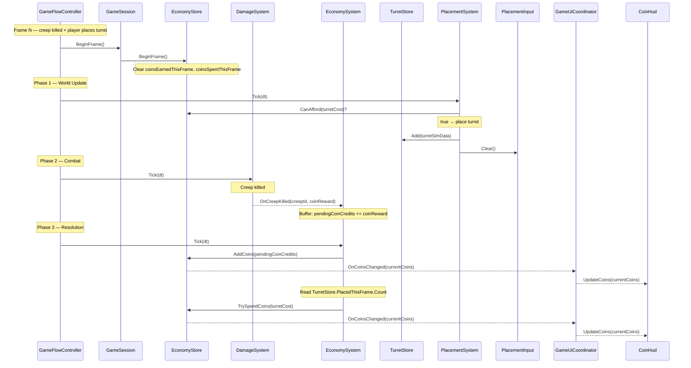
```mermaid
sequenceDiagram
    participant Bootstrap as GameFlowController
    participant Session as GameSession
    participant EStore as EconomyStore
    participant DmgSys as DamageSystem
    participant EcoSys as EconomySystem
    participant TStore as TurretStore
    participant PlaceSys as PlacementSystem
    participant Input as PlacementInput
    participant Coord as GameUiCoordinator
    participant HUD as CoinHud

    Note over Bootstrap: Frame N — creep killed + player places turret

    Bootstrap->>Session: BeginFrame()
    Session->>EStore: BeginFrame()
    Note over EStore: Clear coinsEarnedThisFrame, coinsSpentThisFrame

    Note over Bootstrap: Phase 1 — World Update
    Bootstrap->>PlaceSys: Tick(dt)
    PlaceSys->>EStore: CanAfford(turretCost)?
    Note over PlaceSys: true → place turret
    PlaceSys->>TStore: Add(turretSimData)
    PlaceSys->>Input: Clear()

    Note over Bootstrap: Phase 2 — Combat
    Bootstrap->>DmgSys: Tick(dt)
    Note over DmgSys: Creep killed
    DmgSys-->>EcoSys: OnCreepKilled(creepId, coinReward)
    Note over EcoSys: Buffer: pendingCoinCredits += coinReward

    Note over Bootstrap: Phase 3 — Resolution
    Bootstrap->>EcoSys: Tick(dt)
    EcoSys->>EStore: AddCoins(pendingCoinCredits)
    EStore-->>Coord: OnCoinsChanged(currentCoins)
    Coord-->>HUD: UpdateCoins(currentCoins)
    Note over EcoSys: Read TurretStore.PlacedThisFrame.Count
    EcoSys->>EStore: TrySpendCoins(turretCost)
    EStore-->>Coord: OnCoinsChanged(currentCoins)
    Coord-->>HUD: UpdateCoins(currentCoins)
```

**Key timing:**
- **Phase 1**: `PlacementSystem` checks `CanAfford()` before placing. Turret is added to `TurretStore.PlacedThisFrame`.
- **Phase 2**: `DamageSystem` kills creep, fires `OnCreepKilled(id, reward)`. `EconomySystem` buffers credit locally.
- **Phase 3**: `EconomySystem.Tick()` applies buffered credits first (coins go up), then deducts for each turret in `PlacedThisFrame` (coins go down). Net balance is correct.
- Credits before debits ensures that if a creep kill and turret placement happen in the same frame, the kill reward is applied before the cost is deducted.

---

## Story 7 — Turret Types (Regular & Freezing)

### Class Diagram

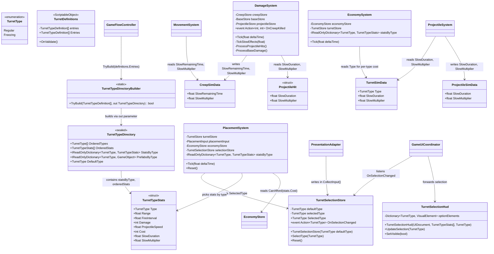
```mermaid
classDiagram
    class TurretType {
        <<enumeration>>
        Regular
        Freezing
    }

    class TurretTypeStats {
        <<struct>>
        +TurretType Type
        +float Range
        +float FireInterval
        +int Damage
        +float ProjectileSpeed
        +int Cost
        +float SlowDuration
        +float SlowMultiplier
    }

    class TurretDefinitions {
        <<ScriptableObject>>
        -TurretTypeDefinition[] entries
        +TurretTypeDefinition[] Entries
        +OnValidate()
    }

    class TurretTypeDirectoryBuilder {
        <<static>>
        +TryBuild(TurretTypeDefinition[], out TurretTypeDirectory) bool
    }

    class TurretTypeDirectory {
        <<sealed>>
        +TurretType[] OrderedTypes
        +TurretTypeStats[] OrderedStats
        +IReadOnlyDictionary~TurretType, TurretTypeStats~ StatsByType
        +IReadOnlyDictionary~TurretType, GameObject~ PrefabsByType
        +TurretType DefaultType
    }

    class TurretSelectionStore {
        -TurretType defaultType
        -TurretType selectedType
        +TurretType SelectedType
        +event Action~TurretType~ OnSelectionChanged
        +TurretSelectionStore(TurretType defaultType)
        +SelectType(TurretType)
        +Reset()
    }

    class TurretSelectionHud {
        -Dictionary~TurretType, VisualElement~ optionElements
        +TurretSelectionHud(UIDocument, TurretTypeStats[], TurretType)
        +UpdateSelection(TurretType)
        +SetVisible(bool)
    }

    class PlacementSystem {
        -TurretStore turretStore
        -PlacementInput placementInput
        -EconomyStore economyStore
        -TurretSelectionStore selectionStore
        -IReadOnlyDictionary~TurretType, TurretTypeStats~ statsByType
        +Tick(float deltaTime)
        +Reset()
    }

    class DamageSystem {
        -CreepStore creepStore
        -BaseStore baseStore
        -ProjectileStore projectileStore
        +event Action~int, int~ OnCreepKilled
        +Tick(float deltaTime)
        -TickSlowEffects(float)
        -ProcessProjectileHits()
        -ProcessBaseDamage()
    }

    class EconomySystem {
        -EconomyStore economyStore
        -TurretStore turretStore
        -IReadOnlyDictionary~TurretType, TurretTypeStats~ statsByType
        +Tick(float deltaTime)
    }

    class CreepSimData {
        +float SlowRemainingTime
        +float SlowMultiplier
    }

    class TurretSimData {
        +TurretType Type
        +float SlowDuration
        +float SlowMultiplier
    }

    class ProjectileSimData {
        +float SlowDuration
        +float SlowMultiplier
    }

    class ProjectileHit {
        <<struct>>
        +float SlowDuration
        +float SlowMultiplier
    }

    PlacementSystem --> TurretSelectionStore : reads SelectedType
    PlacementSystem --> TurretTypeStats : picks stats by type
    PlacementSystem --> EconomyStore : reads CanAfford(stats.Cost)
    PresentationAdapter --> TurretSelectionStore : writes in CollectInput()
    GameUiCoordinator --> TurretSelectionStore : listens OnSelectionChanged
    GameUiCoordinator --> TurretSelectionHud : forwards selection
    DamageSystem --> CreepSimData : writes SlowRemainingTime, SlowMultiplier
    MovementSystem --> CreepSimData : reads SlowRemainingTime, SlowMultiplier
    ProjectileSystem --> TurretSimData : reads SlowDuration, SlowMultiplier
    ProjectileSystem --> ProjectileSimData : writes SlowDuration, SlowMultiplier
    DamageSystem --> ProjectileHit : reads SlowDuration, SlowMultiplier
    EconomySystem --> TurretSimData : reads Type for per-type cost
    GameFlowController --> TurretTypeDirectoryBuilder : TryBuild(definitions.Entries)
    TurretTypeDirectoryBuilder --> TurretTypeDirectory : builds via out parameter
    TurretTypeDirectory --> TurretTypeStats : contains statsByType, orderedStats
```

**Notes:**
- `TurretSelectionStore` follows the Store pattern: authoritative owner of selected turret type, fires `OnSelectionChanged` only on change. Constructor takes `defaultType` (no hardcoded value). Writer: `PresentationAdapter` (data-driven keyboard shortcuts 1-9 from `turretTypeOrder`). Readers: `PlacementSystem`, `GameUiCoordinator`.
- `TurretTypeStats` is the single source of truth for per-type stats (including `Type` field). Built once at bootstrap by `TurretTypeDirectoryBuilder.TryBuild()` from `TurretDefinitions` SO entries. Passed to `PlacementSystem`, `EconomySystem`, and `TurretSelectionHud` as `IReadOnlyDictionary<TurretType, TurretTypeStats>` or `TurretTypeStats[]`.
- `TurretDefinitions` is a single ScriptableObject containing an ordered array of `TurretTypeDefinition` structs. Array order determines default type (`[0]`), keyboard shortcuts (1-9), and HUD layout. `OnValidate()` also detects duplicate TurretType entries.
- `TurretTypeDirectoryBuilder.TryBuild()` validates entries (null prefabs, duplicates) and returns a `TurretTypeDirectory` via single `out` parameter. `TurretTypeDirectory` is an immutable sealed class containing `OrderedTypes`, `OrderedStats`, `StatsByType`, `PrefabsByType`, and `DefaultType`. Pure C# static helper — unit-testable without Unity runtime.
- Slow effect data propagates: `TurretTypeDefinition` → `TurretTypeStats` → `TurretSimData` → `ProjectileSimData` → `ProjectileHit` → `CreepSimData`. Each hop is at creation time except CreepSimData which is written by DamageSystem on hit.
- `DamageSystem` is the single writer for `CreepSimData.SlowRemainingTime` and `SlowMultiplier`. `MovementSystem` reads them to compute effective speed.
- `PresentationAdapter` manages turret pools via `IReadOnlyDictionary<TurretType, GameObjectPool> turretPoolByType`. Tracks per-turret visual info via a `Dictionary<int, TurretVisual>` (`turretVisuals`) where `TurretVisual` is a struct containing the GameObject and its source pool. Adding a new turret type requires zero code changes — just a definitions entry and prefab.

### Slow Effect Sequence — Freezing Turret Hits Creep

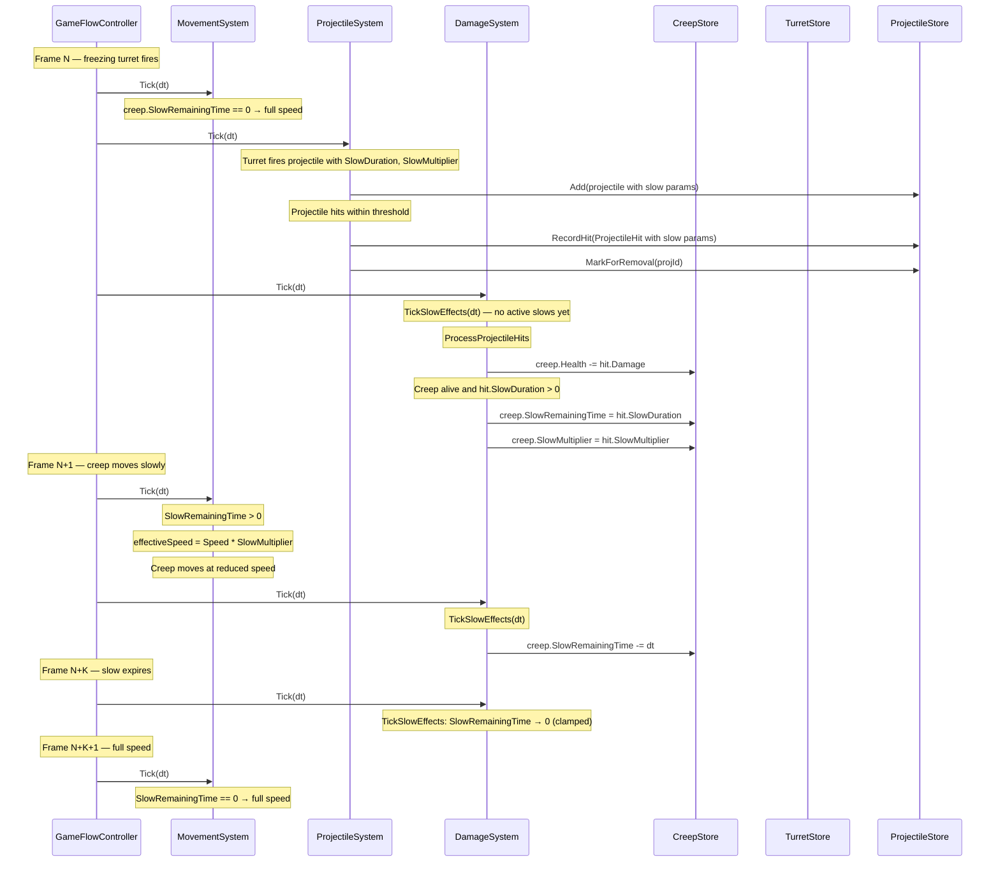
```mermaid
sequenceDiagram
    participant Bootstrap as GameFlowController
    participant Move as MovementSystem
    participant ProjSys as ProjectileSystem
    participant DmgSys as DamageSystem
    participant CStore as CreepStore
    participant TStore as TurretStore
    participant PStore as ProjectileStore

    Note over Bootstrap: Frame N — freezing turret fires

    Bootstrap->>Move: Tick(dt)
    Note over Move: creep.SlowRemainingTime == 0 → full speed

    Bootstrap->>ProjSys: Tick(dt)
    Note over ProjSys: Turret fires projectile with SlowDuration, SlowMultiplier
    ProjSys->>PStore: Add(projectile with slow params)
    Note over ProjSys: Projectile hits within threshold
    ProjSys->>PStore: RecordHit(ProjectileHit with slow params)
    ProjSys->>PStore: MarkForRemoval(projId)

    Bootstrap->>DmgSys: Tick(dt)
    Note over DmgSys: TickSlowEffects(dt) — no active slows yet
    Note over DmgSys: ProcessProjectileHits
    DmgSys->>CStore: creep.Health -= hit.Damage
    Note over DmgSys: Creep alive and hit.SlowDuration > 0
    DmgSys->>CStore: creep.SlowRemainingTime = hit.SlowDuration
    DmgSys->>CStore: creep.SlowMultiplier = hit.SlowMultiplier

    Note over Bootstrap: Frame N+1 — creep moves slowly

    Bootstrap->>Move: Tick(dt)
    Note over Move: SlowRemainingTime > 0
    Note over Move: effectiveSpeed = Speed * SlowMultiplier
    Note over Move: Creep moves at reduced speed

    Bootstrap->>DmgSys: Tick(dt)
    Note over DmgSys: TickSlowEffects(dt)
    DmgSys->>CStore: creep.SlowRemainingTime -= dt

    Note over Bootstrap: Frame N+K — slow expires

    Bootstrap->>DmgSys: Tick(dt)
    Note over DmgSys: TickSlowEffects: SlowRemainingTime → 0 (clamped)

    Note over Bootstrap: Frame N+K+1 — full speed

    Bootstrap->>Move: Tick(dt)
    Note over Move: SlowRemainingTime == 0 → full speed
```

**Key timing:**
- **Frame N**: Projectile hits, DamageSystem applies slow to creep. Slow is NOT yet visible to MovementSystem (already ticked this frame in Phase 1).
- **Frame N+1**: MovementSystem reads `SlowRemainingTime > 0`, computes effective speed. DamageSystem decrements timer.
- **Frame N+K**: Timer reaches zero (clamped). Next frame's MovementSystem sees zero and uses full speed.
- Effective slow duration is `[duration, duration + dt]` due to Phase 1/Phase 2 ordering. Consistent with next-frame visibility model.

---

## Story 8 — Creep Variety

### Class Diagram

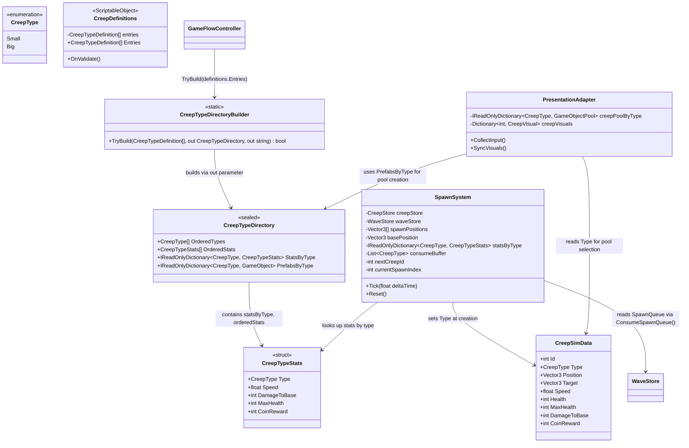
```mermaid
classDiagram
    class CreepType {
        <<enumeration>>
        Small
        Big
    }

    class CreepTypeStats {
        <<struct>>
        +CreepType Type
        +float Speed
        +int DamageToBase
        +int MaxHealth
        +int CoinReward
    }

    class CreepDefinitions {
        <<ScriptableObject>>
        -CreepTypeDefinition[] entries
        +CreepTypeDefinition[] Entries
        +OnValidate()
    }

    class CreepTypeDirectoryBuilder {
        <<static>>
        +TryBuild(CreepTypeDefinition[], out CreepTypeDirectory, out string) bool
    }

    class CreepTypeDirectory {
        <<sealed>>
        +CreepType[] OrderedTypes
        +CreepTypeStats[] OrderedStats
        +IReadOnlyDictionary~CreepType, CreepTypeStats~ StatsByType
        +IReadOnlyDictionary~CreepType, GameObject~ PrefabsByType
    }

    class SpawnSystem {
        -CreepStore creepStore
        -WaveStore waveStore
        -Vector3[] spawnPositions
        -Vector3 basePosition
        -IReadOnlyDictionary~CreepType, CreepTypeStats~ statsByType
        -List~CreepType~ consumeBuffer
        -int nextCreepId
        -int currentSpawnIndex
        +Tick(float deltaTime)
        +Reset()
    }

    class CreepSimData {
        +int Id
        +CreepType Type
        +Vector3 Position
        +Vector3 Target
        +float Speed
        +int Health
        +int MaxHealth
        +int DamageToBase
        +int CoinReward
    }

    class PresentationAdapter {
        -IReadOnlyDictionary~CreepType, GameObjectPool~ creepPoolByType
        -Dictionary~int, CreepVisual~ creepVisuals
        +CollectInput()
        +SyncVisuals()
    }

    GameFlowController --> CreepTypeDirectoryBuilder : TryBuild(definitions.Entries)
    CreepTypeDirectoryBuilder --> CreepTypeDirectory : builds via out parameter
    CreepTypeDirectory --> CreepTypeStats : contains statsByType, orderedStats
    SpawnSystem --> WaveStore : reads SpawnQueue via ConsumeSpawnQueue()
    SpawnSystem --> CreepTypeStats : looks up stats by type
    SpawnSystem --> CreepSimData : sets Type at creation
    PresentationAdapter --> CreepSimData : reads Type for pool selection
    PresentationAdapter --> CreepTypeDirectory : uses PrefabsByType for pool creation
```

**Notes:**
- Mirrors the turret type data-driven pattern from Story 7. `CreepDefinitions` SO + `CreepTypeDirectoryBuilder` + `CreepTypeDirectory` parallel the turret equivalents.
- `SpawnSystem` is a queue consumer (refactored in Story 9). It reads `CreepType` requests from `WaveStore.SpawnQueue` via `ConsumeSpawnQueue()`, looks up stats from `IReadOnlyDictionary<CreepType, CreepTypeStats>`, assigns spawn positions round-robin, and creates `CreepSimData` in `CreepStore`.
- `CreepSimData.Type` is write-once by `SpawnSystem` at creation. `PresentationAdapter` reads it for per-type pool selection.
- `PresentationAdapter` manages creep pools via `IReadOnlyDictionary<CreepType, GameObjectPool> creepPoolByType` (mirrors turret pool pattern). Uses `CreepVisual` struct dictionary (mirrors `TurretVisual`) to track each creep's source pool for correct return-to-pool on removal.
- `CreepTypeDirectory` has no `DefaultType` (unlike `TurretTypeDirectory`).
- Pool budget is split across types (`CeilToInt(total / typeCount)`) — not multiplied.
- Adding a new creep type requires: enum value + definitions entry + prefab — zero system/presentation code changes.

---

## Story 9 — Wave System

### Class Diagram

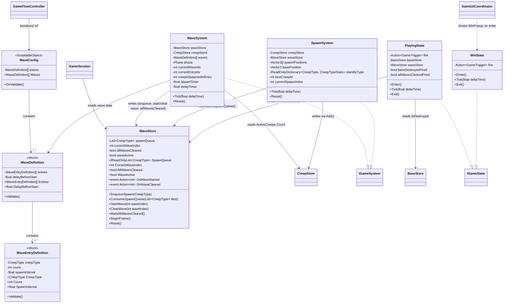
```mermaid
classDiagram
    class WaveConfig {
        <<ScriptableObject>>
        -WaveDefinition[] waves
        +WaveDefinition[] Waves
        +OnValidate()
    }

    class WaveDefinition {
        <<struct>>
        -WaveEntryDefinition[] entries
        -float delayBeforeStart
        +WaveEntryDefinition[] Entries
        +float DelayBeforeStart
        +Validate()
    }

    class WaveEntryDefinition {
        <<struct>>
        -CreepType creepType
        -int count
        -float spawnInterval
        +CreepType CreepType
        +int Count
        +float SpawnInterval
        +Validate()
    }

    class WaveStore {
        -List~CreepType~ spawnQueue
        -int currentWaveIndex
        -bool allWavesCleared
        -bool waveActive
        +IReadOnlyList~CreepType~ SpawnQueue
        +int CurrentWaveIndex
        +bool AllWavesCleared
        +bool WaveActive
        +event Action~int~ OnWaveStarted
        +event Action~int~ OnWaveCleared
        +EnqueueSpawn(CreepType)
        +ConsumeSpawnQueue(List~CreepType~ dest)
        +StartWave(int waveIndex)
        +ClearWave(int waveIndex)
        +MarkAllWavesCleared()
        +BeginFrame()
        +Reset()
    }

    class WaveSystem {
        -WaveStore waveStore
        -CreepStore creepStore
        -WaveDefinition[] waves
        -Phase phase
        -int currentWaveIdx
        -int currentEntryIdx
        -int creepsSpawnedInEntry
        -float spawnTimer
        -float delayTimer
        +Tick(float deltaTime)
        +Reset()
    }

    class SpawnSystem {
        -CreepStore creepStore
        -WaveStore waveStore
        -Vector3[] spawnPositions
        -Vector3 basePosition
        -IReadOnlyDictionary~CreepType, CreepTypeStats~ statsByType
        -int nextCreepId
        -int currentSpawnIndex
        +Tick(float deltaTime)
        +Reset()
    }

    class PlayingState {
        -Action~GameTrigger~ fire
        -BaseStore baseStore
        -WaveStore waveStore
        -bool baseDestroyedFired
        -bool allWavesClearedFired
        +Enter()
        +Tick(float deltaTime)
        +Exit()
    }

    class WinState {
        -Action~GameTrigger~ fire
        +Enter()
        +Tick(float deltaTime)
        +Exit()
    }

    GameSession --> WaveStore : owns
    WaveConfig --> "1..*" WaveDefinition : contains
    WaveDefinition --> "0..*" WaveEntryDefinition : contains
    WaveSystem --> WaveStore : writes (enqueue, start/clear wave, allWavesCleared)
    WaveSystem --> CreepStore : reads ActiveCreeps.Count
    WaveSystem --> WaveDefinition : reads wave data
    WaveSystem ..|> IGameSystem
    SpawnSystem --> WaveStore : reads via ConsumeSpawnQueue()
    SpawnSystem --> CreepStore : writes via Add()
    SpawnSystem ..|> IGameSystem
    PlayingState --> BaseStore : reads IsDestroyed
    PlayingState --> WaveStore : reads AllWavesCleared
    PlayingState ..|> IGameState
    WinState ..|> IGameState
    GameFlowController --> WaveConfig : serialized ref
    GameUiCoordinator ..> WinState : shows WinPopup on enter
```

**Notes:**
- `WaveSystem` is the single writer for `WaveStore`. Readers: `SpawnSystem` (spawn queue), `PlayingState` (AllWavesCleared).
- `WaveSystem` is scene-independent — it only enqueues `CreepType` values into `WaveStore.SpawnQueue`. `SpawnSystem` owns spawn position assignment (round-robin over scene spawn points). Wave definitions are reusable across different scene layouts.
- `WaveDefinition.count` = total creeps per entry, NOT per spawn point.
- Wave-cleared condition: `SpawnQueue.Count == 0 && ActiveCreeps.Count == 0`. Simple; no per-wave creep tracking needed since one wave is active at a time.
- `PlayingState` polls both `BaseStore.IsDestroyed` and `WaveStore.AllWavesCleared`. Lose takes priority over win (BaseDestroyed checked first). One-shot guards prevent double-firing. Once either fires, subsequent ticks are no-ops.
- `WinState` mirrors `LoseState` — empty shell. `GameUiCoordinator.OnStateChanged` instantiates WinPopup on enter, destroys on exit.
- `WaveConfig` replaces `SpawnConfig` as the serialized reference in `GameFlowController`. `SpawnConfig` is retired.
- Internal phase enum in `WaveSystem`: `WaitingToStart` → `Spawning` → `WaitingForClear` → (next wave or `Done`). `MAX_SPAWNS_PER_TICK = 20` burst cap prevents hitching on large deltaTime spikes.
- Time carry-over: when `WaitingToStart` delay elapses mid-tick, only the excess time after the delay flows into the `Spawning` phase via return value pattern.

### Wave Progression Sequence

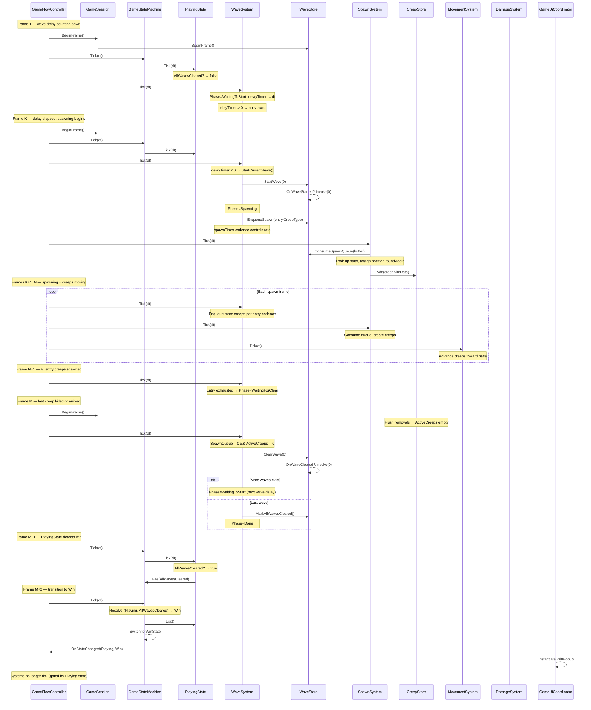
```mermaid
sequenceDiagram
    participant Bootstrap as GameFlowController
    participant Session as GameSession
    participant SM as GameStateMachine
    participant Playing as PlayingState
    participant WaveS as WaveSystem
    participant WStore as WaveStore
    participant Spawn as SpawnSystem
    participant CStore as CreepStore
    participant Move as MovementSystem
    participant Dmg as DamageSystem
    participant Coord as GameUiCoordinator

    Note over Bootstrap: Frame 1 — wave delay counting down

    Bootstrap->>Session: BeginFrame()
    Session->>WStore: BeginFrame()

    Bootstrap->>SM: Tick(dt)
    SM->>Playing: Tick(dt)
    Note over Playing: AllWavesCleared? → false

    Bootstrap->>WaveS: Tick(dt)
    Note over WaveS: Phase=WaitingToStart, delayTimer -= dt
    Note over WaveS: delayTimer > 0 → no spawns

    Note over Bootstrap: Frame K — delay elapsed, spawning begins

    Bootstrap->>Session: BeginFrame()
    Bootstrap->>SM: Tick(dt)
    SM->>Playing: Tick(dt)

    Bootstrap->>WaveS: Tick(dt)
    Note over WaveS: delayTimer ≤ 0 → StartCurrentWave()
    WaveS->>WStore: StartWave(0)
    WStore-->>WStore: OnWaveStarted?.Invoke(0)
    Note over WaveS: Phase=Spawning
    WaveS->>WStore: EnqueueSpawn(entry.CreepType)
    Note over WaveS: spawnTimer cadence controls rate

    Bootstrap->>Spawn: Tick(dt)
    Spawn->>WStore: ConsumeSpawnQueue(buffer)
    Note over Spawn: Look up stats, assign position round-robin
    Spawn->>CStore: Add(creepSimData)

    Note over Bootstrap: Frames K+1..N — spawning + creeps moving

    loop Each spawn frame
        Bootstrap->>WaveS: Tick(dt)
        Note over WaveS: Enqueue more creeps per entry cadence
        Bootstrap->>Spawn: Tick(dt)
        Note over Spawn: Consume queue, create creeps
        Bootstrap->>Move: Tick(dt)
        Note over Move: Advance creeps toward base
    end

    Note over Bootstrap: Frame N+1 — all entry creeps spawned

    Bootstrap->>WaveS: Tick(dt)
    Note over WaveS: Entry exhausted → Phase=WaitingForClear

    Note over Bootstrap: Frame M — last creep killed or arrived

    Bootstrap->>Session: BeginFrame()
    Note over CStore: Flush removals → ActiveCreeps empty

    Bootstrap->>WaveS: Tick(dt)
    Note over WaveS: SpawnQueue==0 && ActiveCreeps==0
    WaveS->>WStore: ClearWave(0)
    WStore-->>WStore: OnWaveCleared?.Invoke(0)

    alt More waves exist
        Note over WaveS: Phase=WaitingToStart (next wave delay)
    else Last wave
        WaveS->>WStore: MarkAllWavesCleared()
        Note over WaveS: Phase=Done
    end

    Note over Bootstrap: Frame M+1 — PlayingState detects win

    Bootstrap->>SM: Tick(dt)
    SM->>Playing: Tick(dt)
    Note over Playing: AllWavesCleared? → true
    Playing->>SM: Fire(AllWavesCleared)

    Note over Bootstrap: Frame M+2 — transition to Win

    Bootstrap->>SM: Tick(dt)
    Note over SM: Resolve (Playing, AllWavesCleared) → Win
    SM->>Playing: Exit()
    SM-->>SM: Switch to WinState
    SM-->>Bootstrap: OnStateChanged(Playing, Win)
    Coord-->>Coord: Instantiate WinPopup
    Note over Bootstrap: Systems no longer tick (gated by Playing state)
```

**Key timing:**
- **Frame K**: `WaveSystem.Tick()` delay elapses, `StartWave()` fires `OnWaveStarted`, first spawn enqueued. `SpawnSystem.Tick()` consumes queue and creates creep.
- **Frame M**: After `BeginFrame()` flushes last creep removal, `WaveSystem.Tick()` detects `SpawnQueue.Count == 0 && ActiveCreeps.Count == 0`. Calls `ClearWave()` / `MarkAllWavesCleared()`. `PlayingState` has already ticked this frame (before systems), so it sees `AllWavesCleared` next frame.
- **Frame M+1**: `PlayingState.Tick()` detects `AllWavesCleared`, fires `AllWavesCleared` trigger (pending).
- **Frame M+2**: State machine resolves trigger, transitions to `Win`. `GameUiCoordinator` shows WinPopup. Systems stop ticking.
- This mirrors the `BaseDestroyed` detection timing: the condition is set by a system during Phase 1, `PlayingState` sees it one frame later.

---

## Story 10 — Game Reset

### Class Diagram Additions

```mermaid
classDiagram
    class PlacementInput {
        +bool PlaceRequested
        +bool RestartRequested
        +Vector3 WorldPosition
        +Clear()
    }

    class RestartHintHud {
        -VisualElement container
        +RestartHintHud(UIDocument)
        +SetVisible(bool)
    }

    class GameUiCoordinator {
        -RestartHintHud restartHintHud
        +Refresh()
        +OnStateChanged(GameState from, GameState to)
    }

    class GameFlowController {
        -WaveSystem waveSystem
        -SpawnSystem spawnSystem
        -PlacementSystem placementSystem
        -ProjectileSystem projectileSystem
        -EconomySystem economySystem
        -PlacementInput placementInput
        +Awake()
        +Update()
        +OnDestroy()
    }

    class PresentationAdapter {
        +CollectInput()
        +SyncVisuals()
        +ResetVisuals()
    }

    GameFlowController --> PlacementInput : checks RestartRequested
    GameFlowController --> GameStateMachine : fires RestartRequested
    GameFlowController --> GameSession : calls Reset()
    GameFlowController --> PresentationAdapter : calls ResetVisuals()
    GameFlowController --> GameUiCoordinator : calls Refresh()
    GameUiCoordinator --> RestartHintHud : toggles visibility
    PresentationAdapter --> PlacementInput : writes RestartRequested in CollectInput()
```

**Notes:**
- `PlacementInput.RestartRequested` is written by `PresentationAdapter.CollectInput()` (R key detection) and read by `GameFlowController.Update()`. Cleared in `PlacementInput.Clear()`.
- `RestartHintHud` follows the same pattern as `CoinHud`/`BaseHealthHud` — plain C# class querying elements from a shared `UIDocument`. Shows "Press R to Restart" text.
- `GameUiCoordinator` shows `RestartHintHud` when entering Win or Lose, hides it otherwise. `Refresh()` forces all HUDs to re-read store values after a reset.
- `GameFlowController` stores system references (previously local vars in `Awake()`) to call `Reset()` on each during restart. Also stores `PlacementInput` to read `RestartRequested`.
- `PresentationAdapter.ResetVisuals()` returns all pooled GameObjects (creeps, turrets, projectiles) to their pools and clears tracking dictionaries.
- `GameStateMachine.Tick()` was fixed to clear `pendingTrigger` BEFORE calling `ResolveTrigger()`, ensuring triggers fired during `Enter()` (e.g., `InitState` fires `SceneValidated`) survive to the next tick.

### Restart Transition Table

| From State | Trigger | To State |
|------------|---------|----------|
| Win | RestartRequested | Init |
| Lose | RestartRequested | Init |

### Game Reset Sequence — Win → Init → Playing

```mermaid
sequenceDiagram
    participant Unity
    participant Bootstrap as GameFlowController
    participant Pres as PresentationAdapter
    participant Input as PlacementInput
    participant SM as GameStateMachine
    participant Win as WinState
    participant Init as InitState
    participant Playing as PlayingState
    participant Session as GameSession
    participant Coord as GameUiCoordinator
    participant Systems as Systems (Wave, Spawn, etc.)

    Note over Unity: Frame N — Win state, player presses R

    Unity->>Bootstrap: Update()
    Bootstrap->>Pres: CollectInput()
    Note over Pres: keyboard[Key.R].wasPressedThisFrame
    Pres->>Input: RestartRequested = true

    Note over Bootstrap: Check restart condition
    Note over Bootstrap: CurrentStateId == Win && RestartRequested
    Bootstrap->>SM: Fire(RestartRequested)

    Bootstrap->>SM: Tick(dt)
    Note over SM: Resolve (Win, RestartRequested) → Init
    SM->>Win: Exit()
    SM-->>SM: Switch to InitState
    SM->>Init: Enter()
    Note over Init: Validate scene, Fire(SceneValidated)
    Note over SM: pendingTrigger = SceneValidated (survives — bug fix)

    SM-->>Bootstrap: OnStateChanged(Win, Init)

    Note over Bootstrap: Reset handler fires
    Bootstrap->>Pres: ResetVisuals()
    Note over Pres: Return all pooled GOs (creeps, turrets, projectiles)

    Bootstrap->>Session: Reset()
    Note over Session: All stores reset to initial values

    Bootstrap->>Systems: Reset() on each system
    Note over Systems: Wave, Spawn, Placement, Projectile, Economy

    Bootstrap->>Coord: Refresh()
    Note over Coord: Force HUD values from fresh stores

    Note over Bootstrap: Systems do NOT tick (gated by Playing)

    Note over Unity: Frame N+1 — SceneValidated resolves

    Unity->>Bootstrap: Update()
    Bootstrap->>Pres: CollectInput()
    Bootstrap->>SM: Tick(dt)
    Note over SM: Resolve (Init, SceneValidated) → Playing
    SM->>Init: Exit()
    SM-->>SM: Switch to PlayingState
    SM->>Playing: Enter()
    SM-->>Bootstrap: OnStateChanged(Init, Playing)
    Note over Coord: Hide RestartHintHud, show gameplay HUDs

    Note over Bootstrap: CurrentStateId == Playing
    Bootstrap->>Session: BeginFrame()
    Note over Session: Clean frame — all stores empty
    Bootstrap->>Systems: Tick(dt) via SystemScheduler
    Note over Systems: Fresh game starts from wave 0, ID 0

    Bootstrap->>Pres: SyncVisuals()
    Note over Pres: New creeps spawned, visuals synced
```

**Key timing:**
- **Frame N** (Win/Lose): R key sets `RestartRequested`. `GameFlowController` fires `RestartRequested` trigger. State machine resolves Win → Init. `InitState.Enter()` fires `SceneValidated` (pending — survives due to trigger-during-Enter bug fix). `OnStateChanged` handler runs the full reset sequence: visuals → stores → systems → UI refresh. Systems do NOT tick (gated by `CurrentStateId == Playing`).
- **Frame N+1**: `SceneValidated` resolves Init → Playing. `PlayingState.Enter()` runs. `GameFlowController` gates system ticking — now enabled. `BeginFrame()` on clean stores, systems tick from wave 0, creep/turret IDs restart from 0. Full fresh game.

**Reset ordering (within OnStateChanged handler):**
1. **ResetVisuals** first — returns pooled GameObjects before stores are cleared, so tracking dictionaries still have valid mappings.
2. **Session.Reset** — clears all stores to initial values (health, coins, creep/turret/projectile lists, wave index).
3. **System resets** — each system clears internal counters (next IDs, spawn timers, pending credits, wave phase).
4. **UI Refresh** — forces all HUDs to re-read current store values, ensuring display matches reset state.

**Trigger-during-Enter fix:**
- `GameStateMachine.Tick()` clears `pendingTrigger` BEFORE calling `ResolveTrigger()`. This ensures that when `InitState.Enter()` fires `SceneValidated`, the trigger is stored as the new `pendingTrigger` and resolves on the next `Tick()`. Without this fix, the trigger was overwritten by the post-resolution `pendingTrigger = null`, causing the game to get stuck in Init on restart.
