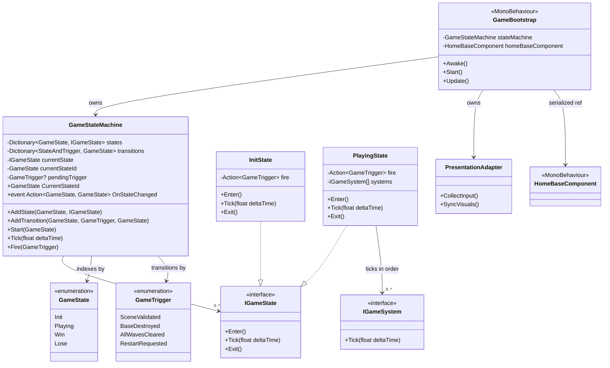

# Architecture Diagrams

Visual companion to TDD.md Section 2 (Detailed Design). Render with any Mermaid-capable viewer.

---

## Class Diagram — Story 1 Foundation



**Notes:**
- `GameBootstrap` is the only "god-level" MonoBehaviour. It is the composition root — creates the state machine, creates states, configures the transition table, and wires references.
- `GameStateMachine` and all `IGameState` implementations are **plain C# classes**, not MonoBehaviours.
- `HomeBaseComponent` is a thin MonoBehaviour on the Base GameObject in the scene. It holds no logic — just identifies the object for system discovery.
- States receive an `Action<GameTrigger>` delegate at construction. They fire semantic triggers (`SceneValidated`, `BaseDestroyed`, etc.) without knowing which state the trigger leads to. The transition table in `GameBootstrap` maps `(state, trigger) → destination`.
- `IGameSystem` provides a uniform `Tick()` contract for gameplay systems. `PlayingState` receives an ordered array at construction and ticks them sequentially.
- `PresentationAdapter` is a **plain C# class** owned by `GameBootstrap`. It is the only place that calls Unity input and rendering APIs. Systems never reference it directly — they read input structs it produces and write sim data it consumes. Stub in Story 1; gains responsibilities as systems are added.
- `Win` and `Lose` states appear in the enum but are implemented in later stories.
- `GameTrigger` values are added incrementally as stories introduce new transitions.

---

## Game State Diagram


**Story 1 scope:** Only `Init` and `Playing` are implemented. `Win` and `Lose` are placeholders in the enum — their `IGameState` classes come in Stories 3 and 9.

**Reset path:** Restart from Win/Lose transitions back to `Init`. `PlayingState.Exit()` tears down spawned objects and system state. `InitState.Enter()` re-validates and sets up a fresh game. No residual state.

---

## Startup Sequence


**Key points:**
- `GameBootstrap.Awake()` constructs everything and configures the transition table. `Start()` kicks off the state machine.
- `InitState.Enter()` fires `SceneValidated` — it does not know the destination. The trigger is **pending** — not resolved until the next `Tick()`.
- The state machine resolves triggers at the **start** of `Tick()`: lookup `(currentState, trigger)` in transition table → `Exit()` old → switch → `Enter()` new → `Tick()` new. This guarantees one clean frame boundary between states.
- States only depend on `Action<GameTrigger>` — no reference to other states or to `GameStateMachine` itself. This makes states independently testable.

---

## Per-Frame Tick Flow


**Frame boundary contract:** Each frame has three phases with unidirectional data flow:
1. **Input collection** — `PresentationAdapter.CollectInput()` reads Unity inputs (mouse position, raycasts, keyboard) and writes them into sim-readable input structs. Systems never call Unity input APIs directly.
2. **Simulation tick** — The state machine ticks the current state, which ticks systems in deterministic phase order. Systems read/write only simulation data (structs, arrays). No Unity API calls.
3. **Visual sync** — `PresentationAdapter.SyncVisuals()` reads simulation state and writes to Unity objects (`Transform.position`, enable/disable GameObjects, UI updates). The sim is unaware this step exists.

**Story 1:** `PlayingState.Tick()` iterates over its `IGameSystem[]` array — which is empty in Story 1. The presentation adapter is a stub in Story 1 and gains responsibilities as systems are added. Future stories add systems to the array in `GameBootstrap`.

---

## Playing State — System Phases & Tick Order

Shows how `IGameSystem` implementations will be ticked by `PlayingState` as stories are implemented. Systems are grouped into three conceptual phases. All systems are plain C# classes implementing `IGameSystem`, registered in order via `GameBootstrap`.


**System phases:**

| Phase | Systems | Purpose |
|-------|---------|---------|
| **1 — World Update** | Wave, Spawn, Movement, Placement | Bring all entities to current-frame state; process player input |
| **2 — Combat** | Targeting, Projectile, Damage | Resolve attacks using positions settled in Phase 1 |
| **3 — Resolution** | Economy, End Conditions | Process rewards and check win/lose after combat settles |

**Tick order within phases:**
1. **Waves** decide what to spawn this frame
2. **Spawn** creates new creeps from wave data
3. **Movement** advances all creeps toward the base
4. **Placement** processes player turret placement input — placed turrets are available for targeting this frame
5. **Targeting** assigns turret targets using settled positions from Phase 1
6. **Projectiles** advance in-flight projectiles, check hits
7. **Damage** applies damage from hits, removes dead creeps, triggers base damage on arrival
8. **Economy** processes coin awards from kills
9. **Conditions** check win/lose after all systems have settled

---

## Folder Structure

```
Assets/
├── Scripts/
│   ├── Core/                   # Bootstrap, state machine, game loop
│   │   ├── GameBootstrap.cs
│   │   ├── GameStateMachine.cs
│   │   ├── GameState.cs        # enum
│   │   ├── GameTrigger.cs      # enum
│   │   ├── IGameState.cs       # interface
│   │   ├── IGameSystem.cs      # interface
│   │   ├── InitState.cs
│   │   └── PlayingState.cs
│   ├── HomeBase/               # Home base identification component
│   │   └── HomeBaseComponent.cs
│   ├── Creeps/                 # (Story 2+)
│   ├── Turrets/                # (Story 4+)
│   ├── Combat/                 # (Story 5+)
│   ├── Economy/                # (Story 6+)
│   ├── Waves/                  # (Story 9)
│   ├── Data/                   # ScriptableObject definitions
│   └── UI/                     # UI Toolkit binding
├── Tests/
│   ├── Editor/
│   │   ├── EditModeTests.asmdef
│   │   └── GameStateMachineTests.cs
│   └── Runtime/
│       └── RuntimeTests.asmdef
├── Prefabs/                    # (provided, unchanged)
├── Scenes/                     # (provided, unchanged)
├── Materials/                  # (provided, unchanged)
└── Terrain/                    # (provided, unchanged)
```

No project-wide namespace. Feature folders group related components, systems, and data.
