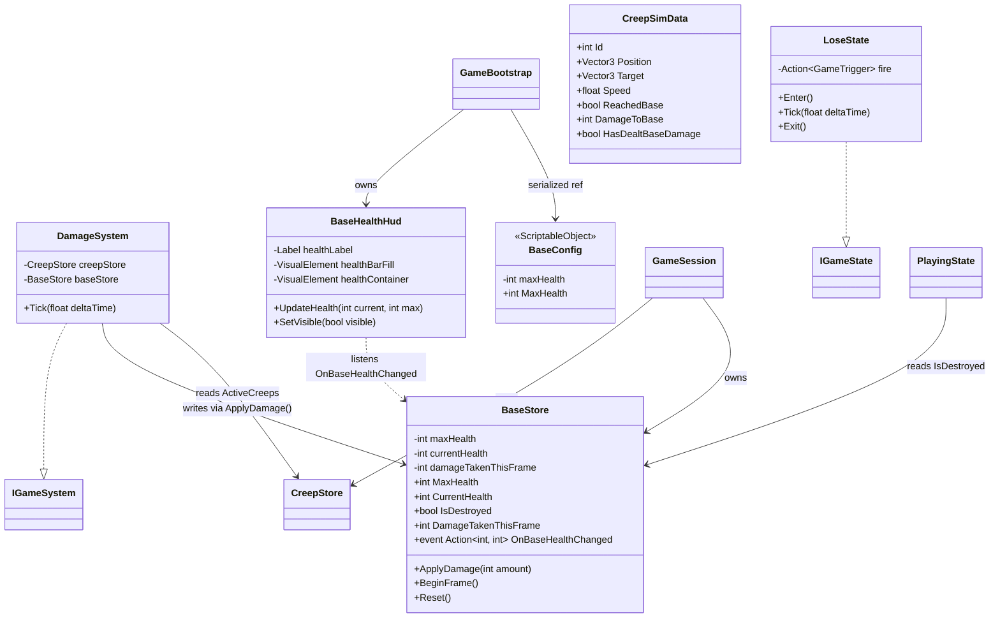

# Architecture Diagrams

Visual companion to TDD.md Section 2 (Detailed Design). Render with any Mermaid-capable viewer.

---

## Class Diagram — Story 1 Foundation


**Notes:**
- `GameBootstrap` is the only "god-level" MonoBehaviour. It is the composition root — creates the state machine, system scheduler, states, and systems. Configures the transition table and wires references.
- `GameStateMachine` and all `IGameState` implementations are **plain C# classes**, not MonoBehaviours.
- `HomeBaseComponent` is a thin MonoBehaviour on the Base GameObject in the scene. It holds no logic — just identifies the object for system discovery.
- States receive an `Action<GameTrigger>` delegate at construction. They fire semantic triggers (`SceneValidated`, `BaseDestroyed`, etc.) without knowing which state the trigger leads to. The transition table in `GameBootstrap` maps `(state, trigger) → destination`.
- **States are flow-only** — they manage enter/exit lifecycle and fire triggers. States do not own or tick systems.
- `SystemScheduler` is a **plain C# class** owned by `GameBootstrap`. It holds the ordered `IGameSystem[]` array and ticks them sequentially. `GameBootstrap.Update()` gates the scheduler — systems only tick when the state machine is in a gameplay state (e.g., `Playing`). This separates flow control (states) from system execution (scheduler).
- `IGameSystem` provides a uniform `Tick()` contract for gameplay systems. Systems are global — they exist independently of game states.
- `PresentationAdapter` is a **plain C# class** owned by `GameBootstrap`. It is the only place that calls Unity input and rendering APIs. Systems never reference it directly — they read input structs it produces and write sim data it consumes. Stub in Story 1; gains responsibilities as systems are added.
- `Win` and `Lose` states appear in the enum but are implemented in later stories.
- `GameTrigger` values are added incrementally as stories introduce new transitions.

---

## Game State Diagram


**Story 1 scope:** Only `Init` and `Playing` are implemented. `Win` and `Lose` are placeholders in the enum — their `IGameState` classes come in Stories 3 and 9.

**Reset path:** Restart from Win/Lose transitions back to `Init`. `PlayingState.Exit()` tears down spawned objects and system state. `InitState.Enter()` re-validates and sets up a fresh game. No residual state.

---

## Startup Sequence


**Key points:**
- `GameBootstrap.Awake()` constructs everything — state machine, system scheduler, states — and configures the transition table. `Start()` kicks off the state machine.
- `InitState.Enter()` fires `SceneValidated` — it does not know the destination. The trigger is **pending** — not resolved until the next `Tick()`.
- The state machine resolves triggers at the **start** of `Tick()`: lookup `(currentState, trigger)` in transition table → `Exit()` old → switch → `Enter()` new → `Tick()` new. This guarantees one clean frame boundary between states.
- States only depend on `Action<GameTrigger>` — no reference to other states or to `GameStateMachine` itself. This makes states independently testable.
- System ticking is separate from state ticking. `GameBootstrap` gates the scheduler based on the current state — systems only run during gameplay.

---

## Per-Frame Tick Flow


**Frame boundary contract:** Each frame has four phases with unidirectional data flow:
1. **Input collection** — `PresentationAdapter.CollectInput()` reads Unity inputs (mouse position, raycasts, keyboard) and writes them into sim-readable input structs. Systems never call Unity input APIs directly.
2. **State tick** — The state machine resolves pending triggers and ticks the current state. States manage flow (enter/exit, fire triggers) — not system execution.
3. **System tick** — `GameBootstrap` gates the `SystemScheduler` based on the current state. Systems tick in deterministic phase order. Systems read/write only simulation data (structs, arrays). No Unity API calls.
4. **Visual sync** — `PresentationAdapter.SyncVisuals()` reads simulation state and writes to Unity objects (`Transform.position`, enable/disable GameObjects, UI updates). The sim is unaware this step exists.

**Story 1:** The `SystemScheduler` holds an empty `IGameSystem[]` array — no systems yet. The presentation adapter is a stub. Future stories add systems to the scheduler in `GameBootstrap`.

---

## System Scheduler — System Phases & Tick Order

Shows how `IGameSystem` implementations will be ticked by `SystemScheduler` as stories are implemented. Systems are grouped into three conceptual phases. All systems are plain C# classes implementing `IGameSystem`, registered in order via `GameBootstrap`. The scheduler is gated by the state machine — systems only tick during gameplay states.


**System phases:**

| Phase | Systems | Purpose |
|-------|---------|---------|
| **1 — World Update** | Wave, Spawn, Movement, Placement | Bring all entities to current-frame state; process player input |
| **2 — Combat** | Projectile, Damage | Resolve attacks using positions settled in Phase 1 |
| **3 — Resolution** | Economy, End Conditions | Process rewards and check win/lose after combat settles |

**Tick order within phases:**
1. **Waves** decide what to spawn this frame
2. **Spawn** creates new creeps from wave data
3. **Movement** advances all creeps toward the base
4. **Placement** processes player turret placement input — placed turrets are available for targeting this frame
5. **Projectiles** fires new projectiles (inline target selection: nearest alive creep in range), advances in-flight projectiles, checks hits, records hits via `ProjectileStore.RecordHit()`
6. **Damage** applies projectile hit damage to creeps, removes dead creeps (`OnCreepKilled`), applies base damage on arrival (dead-creep guard skips killed creeps)
8. **Economy** processes coin awards from kills
9. **Conditions** check win/lose after all systems have settled

---

## Folder Structure

```
Assets/
├── Scripts/
│   ├── Core/                   # Bootstrap, session, state machine, scheduler, game loop
│   │   ├── GameBootstrap.cs
│   │   ├── GameSession.cs
│   │   ├── GameStateMachine.cs
│   │   ├── SystemScheduler.cs
│   │   ├── PresentationAdapter.cs
│   │   ├── GameState.cs        # enum
│   │   ├── GameTrigger.cs      # enum
│   │   ├── IGameState.cs       # interface
│   │   ├── IGameSystem.cs      # interface
│   │   ├── InitState.cs
│   │   ├── PlayingState.cs
│   │   └── LoseState.cs
│   ├── ObjectPooling/          # Reusable pool infrastructure (namespaced)
│   │   ├── IPoolable.cs
│   │   └── GameObjectPool.cs
│   ├── HomeBase/               # Home base component and store
│   │   ├── HomeBaseComponent.cs
│   │   └── BaseStore.cs
│   ├── Creeps/                 # Creep store, sim data, systems, components
│   │   ├── CreepStore.cs
│   │   ├── CreepSimData.cs
│   │   ├── SpawnSystem.cs
│   │   ├── MovementSystem.cs
│   │   ├── SpawnPointComponent.cs
│   │   └── CreepComponent.cs
│   ├── Data/                   # ScriptableObject definitions
│   │   ├── CreepDef.cs
│   │   ├── SpawnConfig.cs
│   │   ├── BaseConfig.cs
│   │   └── TurretDef.cs
│   ├── Turrets/                # Turret store, sim data, placement system, input, component
│   │   ├── TurretStore.cs
│   │   ├── TurretSimData.cs
│   │   ├── PlacementSystem.cs
│   │   ├── PlacementInput.cs
│   │   └── TurretComponent.cs
│   ├── Combat/                 # DamageSystem, ProjectileSystem, ProjectileStore
│   │   ├── DamageSystem.cs
│   │   ├── ProjectileSystem.cs
│   │   ├── ProjectileStore.cs
│   │   ├── ProjectileSimData.cs
│   │   ├── ProjectileHit.cs
│   │   └── ProjectileComponent.cs
│   ├── Economy/                # (Story 6+)
│   ├── Waves/                  # (Story 9)
│   └── UI/                     # BaseHealthHud (Story 3+)
├── Tests/
│   ├── Editor/
│   │   ├── EditModeTests.asmdef
│   │   ├── GameStateMachineTests.cs
│   │   ├── InitStateTests.cs
│   │   ├── SystemSchedulerTests.cs
│   │   ├── CreepStoreTests.cs
│   │   ├── SpawnSystemTests.cs
│   │   ├── MovementSystemTests.cs
│   │   ├── GameObjectPoolTests.cs
│   │   ├── CreepSpawningIntegrationTests.cs
│   │   ├── BaseStoreTests.cs
│   │   ├── DamageSystemTests.cs
│   │   ├── PlayingStateTests.cs
│   │   ├── LoseStateTests.cs
│   │   ├── BaseHealthIntegrationTests.cs
│   │   ├── TurretStoreTests.cs
│   │   ├── PlacementSystemTests.cs
│   │   ├── TurretPlacementIntegrationTests.cs
│   │   ├── ProjectileStoreTests.cs
│   │   ├── ProjectileSystemTests.cs
│   │   └── TurretShootingIntegrationTests.cs
│   └── Runtime/
│       └── RuntimeTests.asmdef
├── Prefabs/                    # (provided, unchanged)
├── Scenes/                     # (provided, unchanged)
├── Materials/                  # (provided, unchanged)
└── Terrain/                    # (provided, unchanged)
```

No project-wide namespace. Feature folders group related components, systems, stores, and data. Generic reusable infrastructure (`ObjectPooling`) gets its own namespace.

---

## Story 2 — Creep Spawning & Movement

### Class Diagram


**Notes:**
- `SpawnSystem` and `MovementSystem` depend only on `CreepStore`, never on each other. No system-to-system coupling.
- `CreepStore` manages deferred removals: `MarkForRemoval()` buffers IDs, `BeginFrame()` flushes them and populates `RemovedIdsThisFrame`.
- `PresentationAdapter` reads `SpawnedThisFrame` and `RemovedIdsThisFrame` to efficiently manage the object pool — no O(n^2) diffing.
- `GameObjectPool.Acquire(position)` sets transform position before activation to avoid one-frame visual pop at origin.

### Creep Lifecycle Sequence


---

## Story 3 — Base Health & Lose Condition

### Class Diagram



**Notes:**
- `DamageSystem` reads `CreepStore.ActiveCreeps` and writes `BaseStore` via `ApplyDamage()`. Gates on `ReachedBase && !HasDealtBaseDamage` to prevent double-damage.
- `BaseStore` fires `OnBaseHealthChanged` for UI updates. `ApplyDamage` is idempotent after destruction (no event, no state change once health is 0).
- `PlayingState` polls `BaseStore.IsDestroyed` in `Tick()` — not event-driven — because event handlers must not fire game triggers per the event handler discipline.
- `LoseState` is empty; `GameBootstrap.OnStateChanged` toggles the LosePopup as a presentation concern.
- `BaseHealthHud` is a plain C# class (not MonoBehaviour) that binds to a `UIDocument` and updates via `OnBaseHealthChanged` event.

### Base Damage Sequence


**Key timing:**
- **Frame N**: MovementSystem sets `ReachedBase`, DamageSystem applies damage, HUD updates via event.
- **Frame N+1**: `PlayingState.Tick()` detects `IsDestroyed`, fires `BaseDestroyed` (pending trigger).
- **Frame N+2**: State machine resolves trigger, transitions to Lose, popup appears.
- Systems do not tick in Lose state (gated by `CurrentStateId == Playing` in `GameBootstrap.Update()`).

---

## Story 4 — Turret Placement

### Class Diagram


**Notes:**
- `PlacementInput` is a shared object created by `GameBootstrap` and passed to both `PresentationAdapter` (writer) and `PlacementSystem` (reader). Neither depends on the other.
- `TurretStore` is minimal for Story 4: no removal pipeline. `BeginFrame()` clears `PlacedThisFrame`. `Reset()` clears everything.
- `PlacementSystem` clears `PlacementInput` after consuming to prevent double-placement if execution order changes.
- `TurretComponent` follows `CreepComponent` pattern: thin MonoBehaviour + `IPoolable`, no logic.

### Turret Placement Sequence


---

## Story 5 — Turret Shooting & Creep Damage

### Class Diagram


**Notes:**
- `ProjectileSystem` handles three concerns internally: firing (with inline target selection), movement, and hit detection. No separate `TargetingSystem`.
- Target selection is ephemeral — `FindNearestCreepInRange` scans creeps at fire time, skipping dead (`Health <= 0`) and arrived (`ReachedBase`) creeps.
- `ProjectileStore.HitsThisFrame` bridges `ProjectileSystem` (writer) → `DamageSystem` (reader). DamageSystem remains the single writer for `CreepSimData.Health`.
- `DamageSystem.OnCreepKilled` event provides a forward hook for Story 6 `EconomySystem`.
- Dead-creep guards: `MovementSystem` skips `Health <= 0`, `DamageSystem.ProcessBaseDamage` skips `Health <= 0`.
- `TurretSimData` gains combat fields (Range, FireInterval, Damage, ProjectileSpeed, FireCooldown) written once at placement by `PlacementSystem`, read each tick by `ProjectileSystem`.

### Combat Sequence — Turret Fires, Projectile Hits, Creep Dies


**Key timing:**
- **Frame N**: `ProjectileSystem` fires projectile, moves it, detects hit. `DamageSystem` processes hit, reduces creep health, marks dead creep for removal.
- **Frame N+1**: `BeginFrame()` flushes removals. `PresentationAdapter` returns creep and projectile GOs to their pools.
- Fast projectiles (high speed, close range) may fire and hit in the same tick. Slow projectiles persist across multiple frames, homing toward the target.
- If target is removed/dead before projectile impact, `MoveProjectiles` discards the projectile (marks for removal, no hit recorded).
